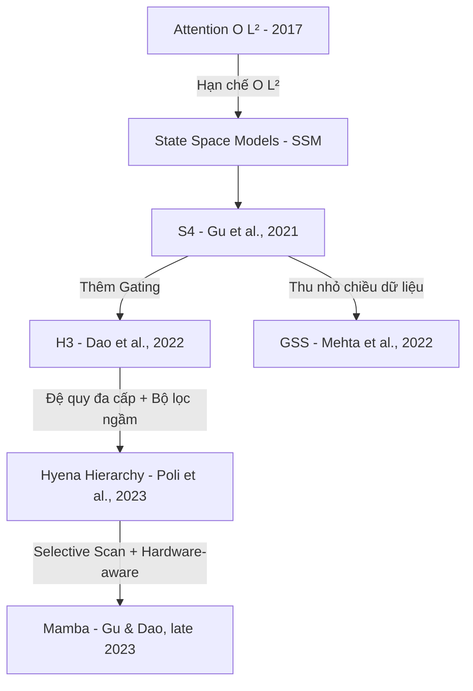

# Related Work Notes — Các Kiến Trúc Thay Thế Attention
**Phụ trách:** Thành viên 1 (TV1) | **Deadline:** Đầu Tuần 2

---

Tài liệu này tổng hợp lý thuyết và phân tích so sánh về sự tiến hóa của các kiến trúc subquadratic thay thế Attention, từ State Space Models (SSM) đời đầu đến **Hyena Hierarchy** và **Mamba**.

---

## 1. State Space Models (SSM) & S4 (2021)

### 1.1 Cơ sở lý thuyết SSM
SSM ánh xạ chuỗi đầu vào $u(t) \in \mathbb{R}$ sang chuỗi trạng thái ẩn $x(t) \in \mathbb{R}^N$ và đầu ra $y(t) \in \mathbb{R}$ qua hệ phương trình vi phân tuyến tính:
$$ x'(t) = A x(t) + B u(t) $$
$$ y(t) = C x(t) + D u(t) $$

Trong thực tế máy tính, hệ được rời rạc hóa (discretized) bằng các phương pháp như Bilinear/Bilinear (Tustin) transformation hoặc Zero-Order Hold (ZOH) thành:
$$ x_t = \bar{A} x_{t-1} + \bar{B} u_t $$
$$ y_t = \bar{C} x_t + \bar{D} u_t $$

*   **Pha huấn luyện (Parallel Representation):** SSM tương đương với phép tích chập (convolution):
    $$ y = u * K $$
    Trong đó bộ lọc tích chập $K$ có độ dài bằng chuỗi $L$: $K = (\bar{C}\bar{B}, \bar{C}\bar{A}\bar{B}, ..., \bar{C}\bar{A}^{L-1}\bar{B})$. Phép tính này thực hiện cực nhanh qua FFT với độ phức tạp $O(L \log L)$.
*   **Pha suy luận (Recurrent Representation):** Trở về dạng truy hồi $O(1)$ per step, không cần lưu trữ KV Cache khổng lồ như Transformer.

### 1.2 Đóng góp của S4 (Structured State Spaces)
Bộ lọc SSM thông thường bị suy giảm gradient nghiêm trọng khi chuỗi quá dài. S4 (Gu et al., 2021) giải quyết bằng cách định nghĩa ma trận $A$ dưới dạng cấu trúc đặc biệt **HiPPO (High-order Polynomial Projection Operators)** để lưu trữ lịch sử chuỗi dưới dạng các đa thức Legendre. S4 lưu trữ $A$ dưới dạng tổng của ma trận đường chéo và ma trận hạng 1 (NPLR - Normal Plus Low-Rank), giúp tính toán ma trận chuyển đổi cực nhanh.

**Hạn chế của S4:** Không có cơ chế nhân cổng động phụ thuộc vào dữ liệu đầu vào (data-controlled gating), làm giảm hiệu năng đáng kể trên các tác vụ đòi hỏi sự ghi nhớ chọn lọc như ngôn ngữ tự nhiên.

---

## 2. H3 — Hungry Hungry Hippos (2022)

H3 (Dao et al., 2022) là kiến trúc tiên phong tích hợp thành công SSM vào các mô hình ngôn ngữ lớn (LMs).

*   **Kiến trúc:** H3 giải quyết điểm yếu "data-control" bằng cách sử dụng phép nhân cổng (gating) element-wise giữa đầu ra của các tầng SSM. Cấu trúc một khối H3 gồm 2 lớp SSM:
    $$ x_1 = \text{SSM}_1(u) $$
    $$ x_2 = \text{SSM}_2(u) $$
    $$ y = \text{Linear}(x_1 \cdot \text{SSM}_3(x_2)) $$
*   **Vị trí của H3:** H3 là mô hình attention-free đầu tiên đạt chất lượng perplexity tiệm cận Transformer ở quy mô 125M params trên WikiText-103.

---

## 3. Hyena Hierarchy (ICML 2023)

Hyena Hierarchy ra đời nhằm tổng quát hóa và nâng cấp H3 lên một tầm cao mới.

*   **Tổng quát hóa H3:** Hyena loại bỏ hoàn toàn cấu trúc SSM phức tạp (với các phép toán ma trận HiPPO nặng nề). Thay vào đó, Hyena định nghĩa phép toán dưới dạng **đệ quy đa cấp (order-$N$ recurrence)** kết hợp tích chập dài và gating trực tiếp:
    $$ z^(n+1)_t = x^n_t \cdot (h^n * z^n)_t $$
    Với $N=2$, Hyena đạt được cấu trúc tương tự H3 nhưng linh hoạt hơn nhiều.
*   **Bộ lọc ngầm định (Implicit Filters):** Thay vì học trực tiếp các tham số của ma trận SSM ($A, B, C$), Hyena học trực tiếp bộ lọc tích chập $h$ thông qua mạng FFN nhận positional encoding của vị trí $t$. Điều này giúp bộ lọc có thể dài tùy ý (bằng chiều dài chuỗi $L$) nhưng có số lượng tham số cố định $O(1)$ theo $L$.
*   **Ưu điểm:** Khả năng mở rộng vượt trội trên chuỗi dài, giải quyết được các tác vụ associative recall phức tạp mà H3 và các SSM khác gặp khó khăn ở chiều dài lớn.

---

## 4. Mamba — Selective State Space Models (Cuối 2023)

Mamba (Gu & Dao, 2023) là bước phát triển tiếp theo ngay sau Hyena.

*   **Sự kế thừa:** Mamba quay trở lại sử dụng SSM cốt lõi nhưng tích hợp cơ chế chọn lọc (**Selective Scan**).
*   **Khác biệt chính với Hyena:**
    *   **Tích chập tĩnh vs Quét động:** Bộ lọc tích chập của Hyena (mặc dù được sinh bởi FFN) là **tĩnh** trong suốt chuỗi đối với một mẫu cụ thể (weights của filter không đổi theo thời gian $t$). Mamba làm cho các ma trận rời rạc hóa $\bar{B}, \bar{C}$ và tham số bước thời gian $\Delta$ thay đổi biến thiên liên tục theo từng token đầu vào $u_t$.
    *   **Giải pháp tính toán:** Vì các tham số của Mamba thay đổi theo thời gian, phép tích chập qua FFT **không thể áp dụng được nữa** (do tính chất phi tuyến). Mamba giải quyết bài toán tính toán bằng một thuật toán quét song song (**Associative Scan**) được cài đặt bằng CUDA kernel tùy chỉnh tối ưu sâu, trực tiếp ghi/đọc trên SRAM của GPU để tránh nghẽn băng thông bộ nhớ.
    *   **Hiệu năng:** Mamba đạt được chất lượng ngôn ngữ vượt trội ở mọi quy mô tham số và khắc phục được điểm yếu của các bộ lọc tích chập tĩnh trong việc theo dõi thông tin chi tiết qua thời gian.

---

## 5. Tổng Kết Landscape Alternatives

| Kiến trúc | Phép toán mixing | Cơ chế Gating | Phức tạp huấn luyện | Điểm mạnh chính | Điểm yếu chính |
| :--- | :--- | :--- | :--- | :--- | :--- |
| **Transformer** | Attention | Không (chỉ có FFN layer) | $O(L^2)$ | Biểu diễn ngữ cảnh đầy đủ, dễ tối ưu trên phần cứng. | Bottleneck $O(L^2)$ bộ nhớ và tính toán. |
| **S4** | SSM (convolution) | Không | $O(L \log L)$ | Học phụ thuộc dài tốt, suy luận cực nhanh. | Yếu trên tác vụ ngôn ngữ tự nhiên do thiếu gating. |
| **H3** | SSM (convolution) | Có (2 SSM nhân nhau) | $O(L \log L)$ | Thể hiện tốt trên ngôn ngữ tự nhiên. | Cấu trúc SSM phức tạp, khó cấu hình và debug. |
| **Hyena** | Implicit Long Conv | Có (truy hồi đệ quy bậc N) | $O(N \cdot L \log L)$ | Cực nhanh trên chuỗi dài, cấu trúc đơn giản, không cần SSM. | Cần kernel FFTConv tối ưu sâu; hội tụ chậm ở scale nhỏ. |
| **Mamba** | Selective SSM | Có (tích hợp trong chọn lọc) | $O(L)$ (qua CUDA Scan) | Chất lượng ngôn ngữ vượt trội, hiệu năng tuyến tính. | Phụ thuộc hoàn toàn vào phần cứng GPU và CUDA kernel. |

---
*File này là output của Thành viên 1, Tuần 2. Cập nhật lần cuối: 11/06/2026*
