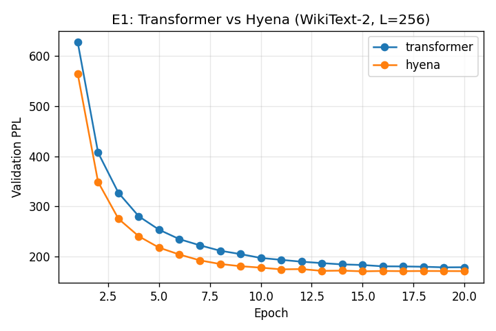
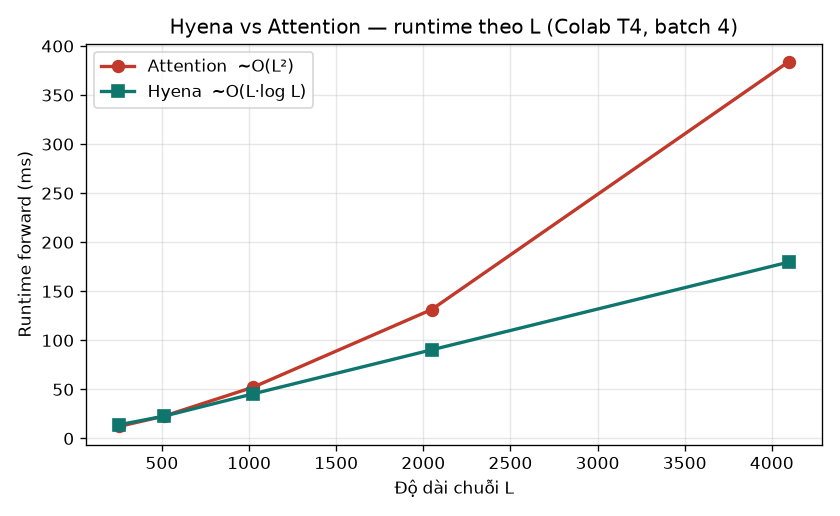

<!-- _class: lead -->
<!-- _paginate: false -->

<div class="titlebox">

# Hyena Hierarchy
### Towards Larger Convolutional Language Models

</div>

<span class="small">Bài báo: Poli, Massaroli, Nguyen, Dao, Baccus, Bengio, Ermon, Ré · Stanford & Mila · ICML 2023 (PMLR 202)</span>

<br>

**Nhóm 08 · CS2308**
Trần Tú Quang · Tô Huỳnh Minh Tiến · Nguyễn Cao Trung Kiên

<span class="small">GVHD: TS. Nguyễn Văn Kiệt · University of Information Technology, VNU-HCM (UIT) · 2026</span>

<!--
Notes:
Mở đầu cả buổi (TV1 — Kiên). Dẫn người nghe từ Transformer/Attention tới đúng "vấn đề" mà Hyena giải quyết; bàn giao Tiến (TV2) cho cơ chế Hyena; Quang (TV3) cho phần tái hiện thực nghiệm.
-->

---

## Nội dung trình bày

1. **Bối cảnh & động lực** — vì sao cần thay thế attention
2. **Nhắc lại nền tảng** — Language Modeling, Perplexity, Transformer
3. **Self-Attention & nút thắt** — cơ chế Q, K, V và chi phí $O(L^2)$
4. **Khoảng cách năng lực & Related Work** — SSM → H3/GSS → Hyena → Mamba
5. **Cơ chế Hyena** — long convolution + data-controlled gating + recurrence
6. **Hiện thực hiệu quả & kết quả paper** — matrix view, FFTConv, complexity
7. **Thực nghiệm** — Transformer-small và Hyena-small trên WikiText-2

<!--
Notes:
Nói nhanh agenda (~30s): 4 mạch của Kiên, 2 mạch của Tiến (method + results), phần thực nghiệm tái hiện của Quang.
-->

---

<!-- _class: divider -->
<!-- footer: '<span>Nhóm 08 · CS2308</span><span>1 · Bối cảnh & động lực</span><span>2026</span>' -->

<div class="dnum">1</div>

<div class="dbar"></div>

# Bối cảnh & Động lực

<div class="dsub">Vì sao attention O(L²) là nút thắt · long-context · capability gap</div>

<div class="dmeta">Phần 1</div>


---

## Câu hỏi nghiên cứu

### "Is attention all we need?"

- Self-attention là **trái tim** của Transformer và tạo nên hầu hết thành công của nó.
- Nhưng attention có **chi phí bậc hai** $O(L^2)$ theo độ dài chuỗi $L$ → đặt **giới hạn cứng** lên lượng ngữ cảnh.
- Các toán tử dưới-bậc-hai trước đây (Linformer, Reformer, Performer, sparse…) đều phải **lai ghép** với attention dày đặc mới đạt chất lượng.

<div class="box">

**Câu hỏi trung tâm (paper · Section 1):**
*“Are there subquadratic operators that, inspired by its properties, are able to match its quality at scale?”*

</div>

→ Mục tiêu: toán tử **không-attention**, rẻ hơn, **không cần hybridization**, vẫn sánh ngang Transformer.

<!--
Notes:
"Hook" của cả bài. Đọc to câu hỏi nghiên cứu. Nhấn: paper không xấp xỉ attention mà hỏi liệu có operator KHÁC thay được không.
-->

---

## Vì sao long-context quan trọng?

- Nhiều bài toán thực tế cần **ngữ cảnh dài**: cả cuốn sách, mã nguồn dài, hội thoại dài, văn bản luật.
- Ngoài ngôn ngữ: **chuỗi sinh học (DNA / protein)**, âm thanh dài, ảnh gigapixel.
- Nhưng $L$ tăng → attention tăng chi phí theo $L^2$ → nhanh chóng **hết bộ nhớ (OOM)** và **chậm**.

<div class="box">

"Phá vỡ rào cản bậc hai" mở ra: dùng cả textbook làm ngữ cảnh, sinh nhạc dài, xử lý ảnh cực lớn *(paper · Section 1)*.

</div>

<!--
Notes:
Cho 2-3 ví dụ cụ thể để khán giả thấy long-context không phải nhu cầu lý thuyết. Đây là động lực để tìm operator rẻ hơn.
-->

---

<!-- _class: divider -->
<!-- footer: '<span>Nhóm 08 · CS2308</span><span>2 · Nhắc lại nền tảng</span><span>2026</span>' -->

<div class="dnum">2</div>

<div class="dbar"></div>

# Nhắc lại nền tảng

<div class="dsub">Language Modeling · Perplexity · kiến trúc Transformer</div>

<div class="dmeta">Phần 2</div>


---

## Nhắc lại: Language Modeling & Perplexity

**Autoregressive LM** — dự đoán token kế tiếp:

$$
P(w_1,\dots,w_n)=\prod_{t=1}^{n} P\!\left(w_t \mid w_{<t}\right)
$$

**Perplexity** — thước đo chất lượng LM (càng **thấp** càng tốt):

$$
\mathrm{PPL}=\exp\!\left(-\frac{1}{N}\sum_{t=1}^{N}\log P\!\left(w_t \mid w_{<t}\right)\right)=\exp(\text{loss})
$$

<span class="small">Trong PyTorch: PPL = exp(validation cross-entropy). Đây cũng là metric nhóm dùng ở phần thực nghiệm (Quang).</span>

<!--
Notes:
Giữ gọn. Khán giả chỉ cần nhớ: PPL thấp = đoán token tốt hơn. Cầu nối tới kết quả perplexity của paper và phần reproduction.
-->

---

## Nhắc lại kiến trúc Transformer

<div class="flow">
<div class="step">Tokens</div>
<div class="ar">▼</div>
<div class="step">Token Embedding &nbsp;+&nbsp; Positional Embedding</div>
<div class="ar">▼</div>
<div class="step fill">N × Transformer Block</div>
<div class="ar">▼</div>
<div class="step">LayerNorm &nbsp;→&nbsp; LM Head &nbsp;→&nbsp; logits</div>
</div>

**Một Transformer Block** (Pre-LN + residual):

$$
\begin{aligned}
\mathbf{x} &\;\leftarrow\; \mathbf{x} + \mathrm{MHA}\!\big(\mathrm{LN}(\mathbf{x})\big)\\[2pt]
\mathbf{x} &\;\leftarrow\; \mathbf{x} + \mathrm{FFN}\!\big(\mathrm{LN}(\mathbf{x})\big)
\end{aligned}
$$

→ **Self-Attention** là phép *trộn thông tin* giữa các token — và cũng chính là **nút thắt** ta cần phân tích.

<!--
Notes:
Định vị attention trong block. FFN xử lý theo từng vị trí; attention mới là phần trộn token-token (tốn O(L^2)).
-->

---

<!-- _class: divider -->
<!-- footer: '<span>Nhóm 08 · CS2308</span><span>3 · Self-Attention & nút thắt</span><span>2026</span>' -->

<div class="dnum">3</div>

<div class="dbar"></div>

# Self-Attention & nút thắt

<div class="dsub">Cơ chế Q, K, V · ma trận attention · O(L²) · FlashAttention</div>

<div class="dmeta">Phần 3</div>


---

## Self-Attention hoạt động thế nào

$$
\mathrm{Attention}(Q,K,V)=\mathrm{SoftMax}\!\left(\frac{QK^{\top}}{\sqrt{d_k}}\right)V
$$

- **B1.** Chiếu tuyến tính: $Q=XW_Q,\quad K=XW_K,\quad V=XW_V$.
- **B2.** Điểm tương quan: $S=QK^{\top}/\sqrt{d_k}$ → ma trận $L\times L$.
- **B3.** Causal mask + SoftMax theo hàng → trọng số $A$.
- **B4.** Tổng có trọng số: $\mathrm{Output}=A\,V$.

<span class="small">Multi-Head: chạy nhiều phép attention song song với các $W_Q,W_K,W_V$ khác nhau, rồi nối lại.</span>

<!--
Notes:
Ẩn dụ truy vấn–khóa–giá trị. Nhấn: bước B2 tạo ma trận L×L — gốc rễ của O(L^2). Dẫn sang slide ma trận attention.
-->

---

## Ma trận Attention & Causal Mask

<div class="grid2">
<div>

- Mỗi token tính tương quan với **mọi token** → ma trận $L\times L$.
- **Causal LM:** token tại $t$ chỉ "nhìn" $t'\le t$ → mask **tam giác dưới** ($-\infty$ ở tương lai, sau SoftMax $=0$).
- Số ô cần tính/lưu tỉ lệ với $L^2$.

</div>
<div class="center">

<div class="mono">
&nbsp;&nbsp;&nbsp;&nbsp;k0&nbsp;k1&nbsp;k2&nbsp;k3<br>
q0&nbsp;[&nbsp;●&nbsp;&nbsp;<span class="dim">·</span>&nbsp;&nbsp;<span class="dim">·</span>&nbsp;&nbsp;<span class="dim">·</span>&nbsp;]<br>
q1&nbsp;[&nbsp;●&nbsp;&nbsp;●&nbsp;&nbsp;<span class="dim">·</span>&nbsp;&nbsp;<span class="dim">·</span>&nbsp;]<br>
q2&nbsp;[&nbsp;●&nbsp;&nbsp;●&nbsp;&nbsp;●&nbsp;&nbsp;<span class="dim">·</span>&nbsp;]<br>
q3&nbsp;[&nbsp;●&nbsp;&nbsp;●&nbsp;&nbsp;●&nbsp;&nbsp;●&nbsp;]
</div>

<span class="small">● attend (quá khứ) · <span class="dim">·</span> bị mask</span>

</div>
</div>

→ Đây là lý do attention **không mở rộng** được khi $L$ rất lớn.

<!--
Notes:
Dùng hình tam giác để khán giả "thấy" vì sao chi phí là L×L. Nối sang slide O(L^2).
-->

---

## Nút thắt $O(L^2)$

<div class="grid2">
<div>

| $L$ | Số ô $L^2$ | $L$ tăng 2× |
|---|---|---|
| 256 | 65,536 | — |
| 512 | 262,144 | ~4× |
| 1,024 | 1,048,576 | ~4× |
| 8,192 | 67,108,864 | ~4× |
| 64,000 | ~4.1 × 10⁹ | → **OOM** |

</div>
<div>

- **Thời gian:** $QK^{\top}$, SoftMax, $AV$ đều $\sim O(L^2 d)$ mỗi lớp.
- **Bộ nhớ:** lưu ma trận $L\times L$ cho backprop $\Rightarrow O(L^2)$.

<div class="box">

$L$ tăng **2×** → chi phí tăng **~4×**. Đây là rào cản chính cần phá vỡ.

</div>

</div>
</div>

<!--
Notes:
Slide "đinh" của TV1. Để khán giả nhìn bảng và tự thấy độ tăng bậc hai. Câu chốt: gấp đôi độ dài thì gấp bốn chi phí.
-->

---

## FlashAttention có giải quyết triệt để?

- **FlashAttention** (Dao et al., 2022) tối ưu **truy cập bộ nhớ (IO-aware)**: không vật chất hóa toàn bộ ma trận $L\times L$, tính theo khối trên SRAM.
- → Giảm mạnh **bộ nhớ thực tế**, nhanh hơn 2–4× so với attention thường.

<div class="warn">

**Nhưng:** số phép tính vẫn là $O(L^2)$ — FlashAttention tối ưu *cách chạy*, không đổi *độ phức tạp*. Vẫn khó vươn tới ngữ cảnh cực dài.

</div>

→ Cần một toán tử có **độ phức tạp dưới bậc hai** thật sự, không chỉ tối ưu hằng số.

<!--
Notes:
Câu này hay bị thầy hỏi → nói rõ: FlashAttention là kỹ thuật cài đặt (IO-aware), compute vẫn O(L^2). Đây là lý do paper Hyena vẫn cần thiết.
-->

---

<!-- _class: divider -->
<!-- footer: '<span>Nhóm 08 · CS2308</span><span>4 · Khoảng cách năng lực & Related Work</span><span>2026</span>' -->

<div class="dnum">4</div>

<div class="dbar"></div>

# Khoảng cách năng lực & Related Work

<div class="dsub">Ba năng lực cốt lõi · SSM → H3/GSS → Hyena → Mamba</div>

<div class="dmeta">Phần 4</div>


---

## Khoảng cách năng lực (Capability Gap)

Vì sao các toán tử rẻ trước đây **thua** attention? Paper dùng **mechanistic interpretability** để rút ra **3 năng lực** cần giữ:

| Năng lực | SSM / Conv tĩnh | Attention |
|---|---|---|
| **Data control** — phụ thuộc dữ liệu | <span class="no">Không</span> (tĩnh) | <span class="yes">Có</span> — $A(u)$ |
| **Unrestricted context** — ngữ cảnh không giới hạn | <span class="no">Không</span> (bị locality) | <span class="yes">Có</span> |
| **Sublinear params** — tham số ⟂ độ dài chuỗi | <span class="yes">Có</span> | <span class="yes">Có</span> |

<div class="box">

Hyena được thiết kế để **giữ đồng thời cả ba** — thay vì *xấp xỉ* attention, ta *tái dựng* tính chất của nó bằng primitive rẻ hơn.

</div>

<!--
Notes:
3 tính chất này là bản lề bàn giao sang Tiến (TV2): long convolution + gating dựng lại đúng 3 tính chất này.
-->

---

<!-- _class: tight -->

## Related Work — Hyena nằm ở đâu?

<div class="chips">
<span class="chip alt">Attention 2017</span><span class="sep">→</span>
<span class="chip alt">SSM</span><span class="sep">→</span>
<span class="chip alt">S4 2021</span><span class="sep">→</span>
<span class="chip alt">H3 / GSS 2022</span><span class="sep">→</span>
<span class="chip hot">Hyena 2023</span><span class="sep">→</span>
<span class="chip alt">Mamba ’23</span>
</div>

| Kiến trúc | Phép trộn | Gating | Train | Ghi chú |
|---|---|---|---|---|
| Transformer | Attention | — | $O(L^2)$ | đầy đủ ngữ cảnh, nghẽn $L^2$ |
| S4 | SSM (conv) | Không | $O(L\log L)$ | học phụ thuộc dài, thiếu data-control |
| H3 / GSS | SSM (conv) | Có | $O(L\log L)$ | attention-free đầu tiên sánh Transformer 125M |
| **Hyena** | **Implicit long conv** | Có (recurrence bậc N) | $O(N\,L\log L)$ | **tổng quát hóa H3/GSS**, filter tự do |
| Mamba | Selective SSM | Có | $O(L)$ | ra **sau** Hyena, filter động theo input |

<span class="small">Hyena bậc 2 ⟺ H3 · Hyena bậc 1 ⟺ GSS. "Hierarchy" = họ toán tử có thứ bậc, mô hình cũ là tầng thấp.</span>

<!--
Notes:
Không đi sâu toán. Khán giả thấy "dòng chảy" tiến hóa và vị trí Hyena. Mamba để sau Hyena, nhắc nhẹ để không hiểu nhầm thứ tự thời gian.

★ CÂU CHỐT & BÀN GIAO sang Tiến:
"Ta đã thấy Attention rất mạnh nhưng vướng O(L²), và rút ra ba năng lực cần giữ: data control, ngữ cảnh không giới hạn, tham số độc lập độ dài. Câu hỏi cho phần tiếp theo: làm sao dựng lại đúng ba năng lực đó bằng một toán tử rẻ hơn? Mời Tiến trình bày cơ chế Hyena."
-->

---

<!-- _class: divider -->
<!-- footer: '<span>Nhóm 08 · CS2308</span><span>5 · Cơ chế Hyena</span><span>2026</span>' -->

<div class="dnum">5</div>

<div class="dbar"></div>

# Cơ chế Hyena

<div class="dsub">Long convolution · data-controlled gating · recurrence · hierarchy</div>

<div class="dmeta">Phần 5</div>


---

## Từ Attention Sang Hyena

<div class="box">

**Câu hỏi trọng tâm:** Hyena thay thế self-attention bằng toán tử nào, và vì sao toán tử đó rẻ hơn khi context dài?

</div>

| Attention làm tốt | Vấn đề khi `L` dài | Hyena thay bằng |
|---|---|---|
| Trộn thông tin toàn chuỗi | Ma trận `L × L` | **Long convolution** |
| Chọn lọc theo nội dung input | `O(L²)` time/memory | **Data-controlled gating** |
| Chất lượng LM mạnh | Khó mở rộng long-context | **FFTConv `O(L log L)`** |

<span class="small">Điểm quan trọng: Hyena không tối ưu attention cũ, mà đề xuất một operator attention-free mới.</span>

<!--
Notes:
Phân công nói: Kiên -> attention bottleneck; Tiến -> Hyena operator; Quang -> small-scale reproduction.
Nhấn mạnh Hyena không phải "attention approximation".
Slide chuyển ý từ phần TV1 sang phần method: vấn đề không chỉ là tốc độ, mà là tìm operator thay thế vẫn đủ expressive cho language modeling.
-->

---

## Ý Tưởng Chính Của Hyena

### Hyena = Long Convolution + Data-Controlled Gating

<div class="grid2">

<div>
<strong>Long convolution</strong>
<ul>
  <li>Filter dài gần bằng sequence.</li>
  <li>Mang tín hiệu từ token xa.</li>
  <li>Tính nhanh bằng FFTConv.</li>
</ul>

</div>

<div>
<strong>Gating</strong>
<ul>
  <li>Sinh từ projection của input.</li>
  <li>Nhân element-wise với output conv.</li>
  <li>Tạo tính content-aware.</li>
</ul>

</div>

</div>

<div class="pipeline">
Input u<br>
 -> linear projections: x1, x2, ..., v<br>
 -> z1 = v<br>
 -> repeat: z(n+1) = gate xn * Conv(hn, zn)<br>
 -> output y
</div>

<span class="small">Câu nói ngắn: convolution truyền thông tin xa, gating quyết định giữ thông tin nào.</span>

<!--
Notes:
Slide bản đồ. Các slide sau sẽ bóc từng mảnh: long conv, gating, recurrence, implicit filter, FFTConv.
-->

---

## Long Convolution

### Từ local kernel sang full-context filter

| Mô hình | Kernel/filter | Phạm vi nhìn |
|---|---|---|
| CNN thường | Ngắn, local | Vài token lân cận |
| Hyena | Dài bằng sequence | Toàn bộ context |

$$
(h * u)_t = \sum_{i=0}^{t} h_{t-i}u_i
$$

```text
CNN local:   token t chỉ nhận từ vùng gần     [x x x] ---- t
Long conv:   token t có thể nhận từ rất xa    [x x x x x x x x x] t
```

**Ý nghĩa:** long convolution giúp mô hình hóa phụ thuộc xa mà không cần ma trận attention `L × L`.

<!--
Notes:
Giải thích công thức ở mức trực giác: output tại t là tổng có trọng số của các token trước đó.
Causal conv chỉ nhìn quá khứ, phù hợp language modeling.
-->

---

## Data-Controlled Gating

### Vì sao cần gating?

- Convolution thuần thường khá **tĩnh**: cùng filter áp dụng cho mọi input.
- Language modeling cần chọn lọc theo **ngữ cảnh input**.
- Hyena dùng gate `xⁿ` được chiếu từ input, rồi nhân với output convolution.

<div class="grid2">

<div class="pipeline">
conv output:<br>
[0.8, 0.4, 0.9, 0.2]<br><br>
gate x:<br>
[1.0, 0.1, 0.7, 0.0]
</div>

<div class="pipeline">
selected signal:<br>
[0.8, 0.04, 0.63, 0.0]<br><br>
gate cao -> giữ<br>
gate thấp -> giảm
</div>

</div>

> Long convolution đưa thông tin từ xa về; gating quyết định thông tin nào nên được giữ lại.

<!--
Notes:
Slide quan trọng để trả lời "Hyena data-controlled như thế nào?"
Gate không phải cổng logic 0/1 cứng; nó là tín hiệu liên tục, học được, phụ thuộc input.
-->

---

## Hyena Recurrence

### Công thức trung tâm

$$
z^{n+1}_t = x^n_t \cdot (h^n * z^n)_t
$$

<div class="grid2">

<div>
<table>
  <thead>
    <tr><th>Thành phần</th><th>Ý nghĩa</th></tr>
  </thead>
  <tbody>
    <tr><td><code>z¹ = v</code></td><td>value stream ban đầu</td></tr>
    <tr><td><code>hⁿ</code></td><td>long filter ở bước <code>n</code></td></tr>
    <tr><td><code>xⁿ_t</code></td><td>gate tại token <code>t</code></td></tr>
    <tr><td><code>N</code></td><td>số bậc/order</td></tr>
  </tbody>
</table>

</div>

<div class="pipeline">
Bước n:<br>
1. lấy z(n)<br>
2. Conv với filter h(n)<br>
3. nhân gate x(n)<br>
4. ra z(n+1)
</div>

</div>

<span class="small">Output cuối: `y = z^(N+1)`.</span>

<!--
Notes:
Slide trọng tâm nhất của TV2. Giải thích từng biến thật chậm.
Nếu bị hỏi "Hyena khác CNN ở đâu?": CNN chủ yếu conv; Hyena xen kẽ conv dài và gate phụ thuộc input nhiều bước.
-->

---

## Order-N Hierarchy

### Vì sao gọi là "Hierarchy"?

- Hyena có thể lặp nhiều bước **convolution + gating**.
- `N` càng lớn, operator càng biểu diễn phong phú hơn.
- Các cấu trúc như H3/GSS có thể xem là liên quan ở bậc thấp.
- Trong repo nhóm: Hyena-small dùng **`order = 2`** để dễ reproduction.

<div class="pipeline">
Order 1:  z1 -> Conv h1 -> Gate x1 -> z2<br>
Order 2:  z1 -> Conv h1 -> Gate x1 -> z2 -> Conv h2 -> Gate x2 -> z3<br>
Order N:  repeat N lần -> output
</div>

<div class="warn">
Không cần chứng minh hierarchy; chỉ cần nắm: mỗi order thêm một tầng tương tác có cấu trúc.
</div>

<!--
Notes:
Không cần giải thích sâu H3/GSS, chỉ nói Hyena tổng quát hóa ý tưởng gating + convolution.
-->

---

<!-- _class: divider -->
<!-- footer: '<span>Nhóm 08 · CS2308</span><span>6 · Hiện thực hiệu quả & kết quả paper</span><span>2026</span>' -->

<div class="dnum">6</div>

<div class="dbar"></div>

# Hiện thực hiệu quả & Kết quả paper

<div class="dsub">Matrix view · implicit filter · FFTConv · complexity · kết quả paper</div>

<div class="dmeta">Phần 6</div>


---

## Matrix View

### Trực giác ma trận

| Thành phần Hyena | Dạng ma trận | Trực giác |
|---|---|---|
| Gating `xⁿ` | Diagonal matrix `Dₓ` | nhân từng vị trí/channel |
| Convolution `hⁿ * zⁿ` | Toeplitz matrix `Sₕ` | trượt cùng một filter qua chuỗi |

<div class="box">

Hyena xen kẽ `Dₓ` và `Sₕ`, thay vì tạo một attention matrix dense `L × L`.

</div>

```text
Attention:    y = A(x) · v        A là dense L x L
Hyena:        y ≈ D_x2 · S_h2 · D_x1 · S_h1 · v
```

<span class="small">Điểm chính: vẫn phụ thuộc input qua `Dₓ`, nhưng tận dụng cấu trúc để tính rẻ hơn.</span>

<!--
Notes:
Slide khó nhất. Chỉ nói trực giác, không chứng minh butterfly decomposition.
Nếu thầy hỏi sâu: D_x là diagonal nên nhân rẻ; S_h có cấu trúc convolution nên tính bằng FFT.
-->

---

## Implicit Filter

### Filter dài nhưng ít tham số

$$
h_t = \mathrm{Window}(t) \cdot \mathrm{FFN}(\mathrm{PE}(t))
$$

| Cách học filter | Ý tưởng | Vấn đề/lợi ích |
|---|---|---|
| Explicit | lưu trực tiếp `h[0...L-1]` | dài hơn thì thêm tham số |
| Implicit | học hàm sinh `h_t` từ vị trí `t` | tham số nằm trong FFN |

<div class="pipeline">
position t -> Positional Encoding -> small FFN -> raw filter value<br>
raw value * Window(t) -> h_t
</div>

<span class="small">Window/decay giúp filter ổn định hơn ở các khoảng cách xa.</span>

<!--
Notes:
Ẩn dụ: học một công thức sinh filter thay vì học từng điểm của filter.
Đừng sa vào chi tiết kiến trúc FFN; mục tiêu là hiểu tại sao filter dài không làm số tham số nổ theo L.
-->

---

## FFTConv

### Tính long convolution hiệu quả

<div class="box">

**Ý tưởng:** chuyển convolution sang miền tần số để phép convolution trở thành phép nhân element-wise.

</div>

<div class="pipeline">
1. FFT(h) và FFT(u)<br>
2. Nhân element-wise trong miền tần số<br>
3. iFFT để quay lại sequence output
</div>

| Cách tính | Chi phí trực giác | Khi nào quan trọng |
|---|---|---|
| Direct convolution | tốn hơn khi filter rất dài | ít hợp với long-context |
| FFTConv | khoảng `O(L log L)` | lợi khi `L` lớn |

<span class="small">Trong repo: `models/hyena.py -> HyenaOperator._causal_fft_conv`.</span>

<!--
Notes:
Không cần đi sâu Fourier. Chỉ cần giải thích "đổi miền để convolution thành phép nhân".
Cầu nối giữa công thức paper và code trong repo:
H = torch.fft.rfft(h, n=fft_len, dim=-1)
V = torch.fft.rfft(v, n=fft_len, dim=-1)
Y = H * V
y = torch.fft.irfft(Y, n=fft_len, dim=-1)[..., :L]
-->

---

<!-- _class: tight -->

## Complexity Và Ý Nghĩa

### Điểm rơi của Hyena là context dài

| Method | Time | Memory |
|---|---|---|
| Standard Attention | `O(L²)` | `O(L²)` |
| FlashAttention | `O(L²)` compute | tối ưu memory access |
| Hyena | `O(N · L log L)` | gần tuyến tính theo `L` |

<div class="box">

Khi `L` tăng rất lớn, `L log L` tăng chậm hơn `L²`, nên lợi thế của Hyena rõ nhất ở long-context.

</div>

<span class="small">Lưu ý: Hyena không nhất thiết nhanh hơn ở `L` nhỏ vì FFT có overhead.</span>
<span class="small">Giá trị của paper: vừa có novelty kiến trúc, vừa thu hẹp quality gap với Transformer ở long-context.</span>

<!--
Notes:
Nhấn mạnh không nói Hyena luôn nhanh hơn. Lợi thế rõ nhất ở context dài.
FlashAttention vẫn là O(L^2) compute, nhưng tối ưu memory access rất tốt. Vì vậy ở L nhỏ/trung bình có thể vẫn cạnh tranh.
Minh họa số: L=1K: L^2≈1M, LlogL≈10K. L=8K: L^2≈67M, LlogL≈106K. L=64K: L^2≈4.1B, LlogL≈1M.
-->

---

## Kết Quả Paper Gốc

### Paper chứng minh 2 thứ: quality và efficiency

<div class="grid2">

<div>
<strong>Quality</strong>
<table>
  <thead>
    <tr><th>Benchmark</th><th>Kết quả</th></tr>
  </thead>
  <tbody>
    <tr><td>WikiText-103</td><td>Hyena-3 ~ Transformer 125M</td></tr>
    <tr><td>The Pile 335M</td><td>Hyena-2 gần Transformer</td></tr>
    <tr><td>Synthetic tasks</td><td>tốt trên recall/reasoning dài</td></tr>
  </tbody>
</table>

</div>

<div>
<strong>Efficiency</strong>
<table>
  <thead>
    <tr><th>Length</th><th>Kết quả runtime</th></tr>
  </thead>
  <tbody>
    <tr><td>2K</td><td>gần crossover</td></tr>
    <tr><td>8K</td><td>~5x vs attention, ~2x vs FlashAttention</td></tr>
    <tr><td>64K</td><td>&gt;100x trong paper</td></tr>
  </tbody>
</table>

</div>

</div>

<div class="box">

Đây là kết quả của **paper gốc**, không phải kết quả reproduction của nhóm.

</div>

<!--
Notes:
Novelty không nằm ở việc tối ưu attention cũ, mà ở chỗ paper đề xuất một operator attention-free mới kết hợp long convolution, gating và implicit filter.
Kết thúc bằng câu chuyển sang TV3 (Quang): paper chạy scale lớn; nhóm sẽ reproduction nhỏ hơn trên WikiText-2 để kiểm chứng xu hướng.
-->

---

<!-- _class: divider -->
<!-- footer: '<span>Nhóm 08 · CS2308</span><span>7 · Thực nghiệm</span><span>2026</span>' -->

<div class="dnum">7</div>

<div class="dbar"></div>

# Thực nghiệm

<div class="dsub">WikiText-2 · Transformer-small vs Hyena-small · perplexity & tốc độ</div>

<div class="dmeta">Phần 7</div>


---

## Phạm vi & mục tiêu

Nhóm không tái hiện toàn bộ paper, vì The Pile 800GB và GPU lớn vượt quá tài nguyên môn học. Thay vào đó nhóm làm tái hiện ở quy mô nhỏ, mục tiêu là **kiểm chứng xu hướng** chứ không khớp số tuyệt đối.

<div class="box">

Hai câu hỏi nhóm muốn tự trả lời:
1. Ở quy mô nhỏ, **perplexity** của Hyena có ngang Transformer không?
2. Khi **chuỗi dài** ra, Hyena có **lợi thế tốc độ** như paper dự đoán không?

</div>

Code do nhóm tự cài bằng thuần PyTorch, có đối chiếu với bản chính chủ `HazyResearch/safari`.

<!--
Notes:
Nói rõ giới hạn tài nguyên ngay từ đầu để không bị hiểu nhầm là claim đạt lại paper.
-->

---

## Thiết lập thực nghiệm

Dữ liệu: WikiText-2, tokenizer GPT-2, cắt chuỗi theo độ dài 256.

| Cấu hình | Transformer-small | Hyena-small |
|---|---|---|
| Layers | 4 | 4 |
| `d_model` / `d_ff` | 256 / 1024 | 256 / 1024 |
| Trộn thông tin | 4 heads attention | order N=2, FFTConv |
| Params | 16.1M | 16.3M |

Hyena dùng `torch.fft.rfft` thuần PyTorch, không có custom CUDA kernel.
Huấn luyện bằng AdamW kèm warmup rồi cosine, đánh giá bằng val loss quy ra perplexity, chạy trên Colab T4.

<!--
Notes:
Hai model cùng cỡ tham số (~16M) để so sánh công bằng. Khác biệt duy nhất là lớp trộn thông tin.
-->

---

## Kết quả E1: Perplexity (L=256)

| Model | Val loss | Val PPL |
|---|---|---|
| Transformer-small | 5.18 | 178.0 |
| Hyena-small | 5.14 | 170.1 |

<span class="small">20 epoch trên WikiText-2, chạy bằng notebook <code>notebooks/colab_E1_run.ipynb</code>. Đường PPL đã đi ngang (gần hội tụ).</span>

Nhận xét: hai model cùng cỡ tham số cho perplexity gần như ngang nhau, Hyena nhỉnh hơn **~4%**. Đủ để nói Hyena là một baseline ngôn ngữ hợp lệ ở quy mô này.

<!--
Notes:
Trả lời câu hỏi 1: ở quy mô nhỏ, perplexity Hyena ngang (thậm chí hơn nhẹ) Transformer.
Nhấn: đây là số chưa hội tụ, chỉ minh họa xu hướng.
-->

---

<!-- _class: tight -->

## Kết quả: tốc độ & bộ nhớ theo độ dài chuỗi

Đo forward với input giả, cùng cấu hình ~16M tham số, batch 4, trên Colab T4:

| L | TF (ms) | Hyena (ms) | TF (MB) | Hyena (MB) |
|---|---|---|---|---|
| 256 | 12.3 | 14.1 | 269 | 269 |
| 512 | 22.8 | 22.7 | 468 | 468 |
| 1024 | 52.3 | 45.5 | 866 | 864 |
| 2048 | 131.4 | 90.4 | 1670 | 1653 |
| 4096 | **383.9** | **179.7** | 3297 | 3234 |

- **Tốc độ:** ở `L=256` Hyena chậm hơn chút (overhead FFT), hòa quanh `L=512`, rồi vượt dần: **1.45×** ở 2048 và **2.14×** ở 4096. Attention mỗi lần gấp đôi `L` tăng gần ×3 (bình phương), Hyena chỉ ×2 (tuyến tính).
- **Bộ nhớ:** gần bằng nhau ở mọi `L` đo được — ở `d_model` nhỏ này, khác biệt $O(L^2)$ bộ nhớ của attention chưa lộ rõ; lợi thế thấy được nằm ở **thời gian**.

<!--
Notes:
Trả lời câu hỏi 2: crossover quanh L=512, Hyena vượt rõ từ L=1024 — đúng xu hướng paper.
-->

---

## Biểu đồ kết quả reproduction

<div class="grid2">
<div class="center">



<span class="small">E1 — Perplexity theo epoch (WikiText-2, L=256)</span>

</div>
<div class="center">



<span class="small">Runtime forward theo độ dài chuỗi L</span>

</div>
</div>

<div class="box">

Hyena hội tụ **nhanh hơn** Transformer ở E1 (PPL thấp hơn ở mỗi epoch); runtime Hyena tăng **gần tuyến tính**, vượt Transformer từ `L≈1024` và đạt **2.14×** ở `L=4096`.

</div>

<!--
Notes:
Chart > bảng số: cho khán giả thấy ngay xu hướng. Nhắc lại đây là số của nhóm (WikiText-2, 5 epoch chưa hội tụ), không phải số paper.
-->

---

## Thảo luận và giới hạn

- Ở chuỗi ngắn Hyena chậm hơn, vì chi phí FFT và đệm 2L lớn hơn phần tiết kiệm được. Hyena hòa ở khoảng `L = 512`, vượt lên từ `L = 1024` và nhanh **2.14×** ở `L = 4096`, đúng như lưu ý trong paper.
- Bản cài của nhóm có **đơn giản hóa** so với safari: filter dùng SiLU thay cho activation dạng sin, modulation rút gọn, bỏ skip-connection. Vì vậy hội tụ có thể chậm hơn bản gốc.
- Vì dùng thuần PyTorch và không có CUDA kernel, nhóm chưa đạt mức speedup tuyệt đối như paper.
- Phần đo tốc độ dùng input giả để đo thời gian forward, không phải đánh giá perplexity trên tập validation.
- Cần phân biệt rõ: số trên WikiText-103, The Pile và speedup từ 8K đến 64K là của **paper gốc**, còn số WikiText-2 ở đây là của **nhóm**.

<!--
Notes:
Trung thực về giới hạn — đây là phần thầy hay hỏi. Nhấn mạnh ranh giới giữa số của paper và số của nhóm.
-->

---

## Kết luận phần tái hiện

- Nhóm tự cài Hyena bằng thuần PyTorch, phần lõi khớp với bản chính chủ ở FFTConv đệm 2L, short conv depthwise và gating đệ quy bậc N.
- Quan sát đúng xu hướng chính của bài: tốc độ Hyena tăng gần tuyến tính, attention tăng theo bình phương, hai đường giao nhau quanh `L = 512` và Hyena vượt lên rõ từ `L = 1024`.
- Bài học rút ra: hiểu được vì sao attention nghẽn ở chuỗi dài, và thấy được giới hạn thực tế của tái hiện khi thiếu kernel tối ưu và tài nguyên.

> Quy mô nhỏ nhưng đủ để thấy tận mắt cơ chế dưới bậc hai mà bài báo đề xuất.

<!--
Notes:
Chốt: hiểu *vì sao* attention mạnh và *vì sao* nó nghẽn — quan trọng hơn việc chạy lại được số lớn.
-->

---

<!-- _class: lead -->

# Cảm ơn! · Q&A

**Nhóm 08 · CS2308**
Trần Tú Quang · Tô Huỳnh Minh Tiến · Nguyễn Cao Trung Kiên

<span class="small">Tài liệu: Poli et al., *Hyena Hierarchy*, ICML 2023 · docs/poli23a.pdf
Tài liệu nhóm: README.md · notebooks/colab_E1_run.ipynb</span>
