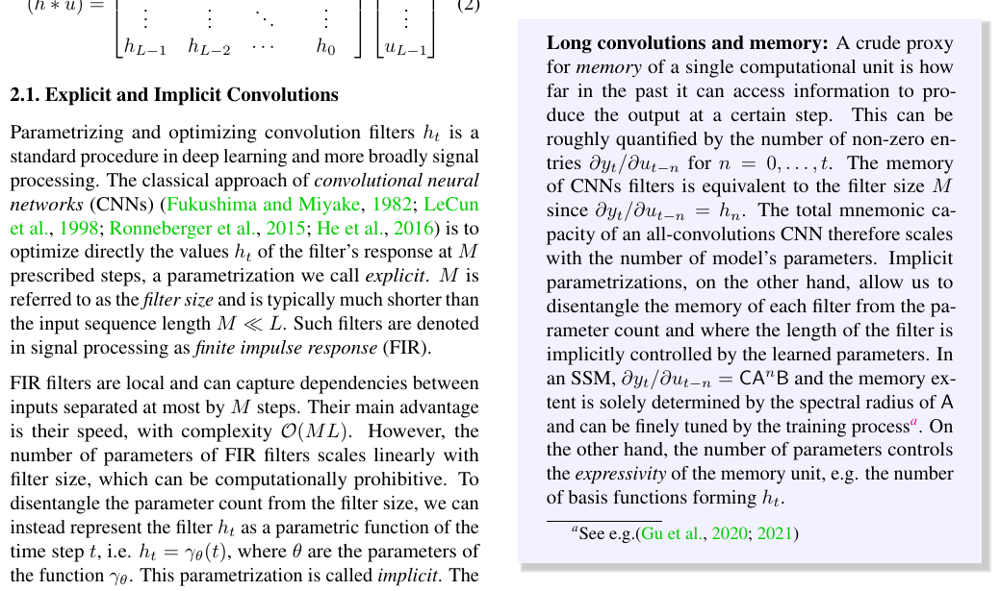
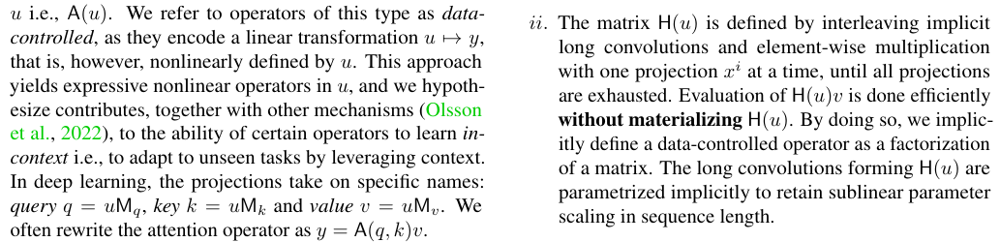

<!-- _class: lead -->
<!-- _paginate: false -->

# Hyena Hierarchy
### Towards Larger Convolutional Language Models

**Poli, Massaroli, Nguyen, Dao, Baccus, Bengio, Ermon, Ré**
Stanford & Mila — ICML 2023 (PMLR 202)

 

*Trình bày theo 6 câu hỏi đọc hiểu — Nhóm 08 · CS2308*
GVHD: TS. Nguyễn Văn Kiệt · HCMC 2026

📂 Tài liệu kèm: [note.md](note.md) (trả lời) · [concept.md](concept.md) (hiểu sâu) · [poli23a.pdf](poli23a.pdf) (paper)

---

## Nội dung trình bày

1. **Bối cảnh & động lực** — *tại sao* nghiên cứu? (Q1)
2. **Định nghĩa bài toán** — 3 thuộc tính của attention + định nghĩa Hyena (Q2)
3. **Đào sâu toán học** — recurrence → ma trận data-controlled → FFTConv → độ phức tạp
4. **Dữ liệu & Đánh giá** — synthetic benchmark + chuẩn (Q3, Q4)
5. **Kết quả & Ảnh hưởng** (Q5)
6. **Đề xuất nghiên cứu tiếng Việt** (Q6)

> ⚠️ Bài *poli23a* không phải về Natural Language Inference — đây là bài về **kiến trúc mô hình ngôn ngữ** (thay thế attention).

---

# 1 · Bối cảnh & Động lực

---

## Vì sao cần thay thế attention?

- Self-attention là trái tim của Transformer, nhưng có **chi phí bậc hai O(L²)** theo độ dài chuỗi `L`.
- Chi phí này đặt **giới hạn cứng** lên lượng ngữ cảnh: khó dùng cả sách, nhạc dài, ảnh gigapixel, chuỗi DNA.
- Các giải pháp dưới bậc hai hiện có (Linformer, Reformer, Performer, sparse…) đều **phải lai ghép** với attention dày đặc mới đạt chất lượng → tồn tại **capability gap**.

**Câu hỏi nghiên cứu trung tâm:**
*“Is attention all we need? Are there subquadratic operators that, inspired by its properties, are able to match its quality at scale?”*

→ Mục tiêu: toán tử **không-attention**, rẻ hơn, **không cần hybridization**, vẫn sánh ngang Transformer ở quy mô lớn.

---

## Khoảng cách năng lực (capability gap)

Vì sao các toán tử rẻ trước đây thua attention? Nhóm tác giả dùng **mechanistic interpretability** để truy ra 3 năng lực mấu chốt mà chúng thiếu:

| Năng lực | SSM / Conv cố định | Attention |
|---|---|---|
| Phụ thuộc dữ liệu (data control) | ✗ tĩnh | ✓ `A(u)` |
| Ngữ cảnh không giới hạn | ✗ thường bị locality | ✓ |
| Số tham số ⟂ độ dài chuỗi | ✓ | ✓ |

→ Hyena được thiết kế để **đồng thời giữ cả ba** — thay vì *xấp xỉ* attention, ta *tái dựng* các tính chất của nó bằng primitive rẻ hơn.

---

# 2 · Định nghĩa bài toán

---

## Ba thuộc tính cần bảo toàn

Phân rã self-attention: $y = A(q,k)\,v$, với $A(u)=\mathrm{SoftMax}\!\big(\tfrac{1}{\sqrt D}\,uM_q M_k^\top u^\top\big)$.

1. **Data control** — `A(u)` là toán tử tuyến tính *do dữ liệu quyết định*: một khối mã hóa cả họ hàm tuyến tính.
2. **Sublinear parameter scaling** — số tham số **tách rời** độ dài chuỗi → dồn được tham số vào FFN.
3. **Unrestricted context** — không áp đặt locality; phụ thuộc tầm xa giữa *bất kỳ* hai vị trí.

**Ý tưởng Hyena:** thay vì xấp xỉ ma trận attention, hãy xây một toán tử **data-controlled** mới từ hai primitive rẻ: **long convolution** + **element-wise gating**.

---

## Định nghĩa toán tử Hyena (bậc N)

Cho `N+1` phép chiếu tuyến tính của đầu vào $(v, x^1,\dots,x^N)$ và `N` bộ lọc dài học được $h^1,\dots,h^N$:

$$
\begin{aligned}
z_t^{1} &= v_t \\
z_t^{n+1} &= x_t^{n}\,\big(h^{n} * z^{n}\big)_t, \quad n=1,\dots,N \\
y_t &= z_t^{N+1}
\end{aligned}
$$

- $x_t^n$ — **gate** phụ thuộc đầu vào (element-wise multiply).
- $h^n * z^n$ — **long convolution** (bộ lọc dài bằng cả chuỗi).
- Khác attention: số phép chiếu **không bắt buộc = 3**; chiều sâu `N` của recurrence là siêu tham số điều khiển bậc của toán tử.

Short recurrences thu được các mô hình cũ (H3, GSS) như trường hợp đặc biệt.

---

# 3 · Đào sâu toán học
## *(phần nhóm khác thường lướt qua)*

---

## Từ recurrence sang dạng ma trận

Recurrence Hyena viết lại được dưới dạng **tích các ma trận data-controlled**:

$$
y = H(u)\,v = D_x^{N}\,S_h^{N}\,\cdots\,D_x^{2}\,S_h^{2}\,D_x^{1}\,S_h^{1}\,v
$$

- $D_x^{n} = \mathrm{diag}(x^{n}) \in \mathbb{R}^{L\times L}$ — ma trận **đường chéo** (chính là gating).
- $S_h^{n} \in \mathbb{R}^{L\times L}$ — ma trận **Toeplitz** sinh bởi bộ lọc $h^n$ (chính là convolution).

> So sánh trực quan (Figure 2): SelfAttention $y=A(q,k)v$ là **một** ma trận dày data-controlled; Hyena là **tích xen kẽ** đường chéo × Toeplitz — một phân rã thưa nhưng vẫn data-controlled, lấy cảm hứng từ *butterfly decomposition*.

---

## Vì sao Hyena tổng quát hóa H3 & GSS

H3 (Dao et al.) thực ra là một phân rã 3 thừa số:

$$
A(q,k) = D_q\, S_\psi\, D_k\, S_\varphi, \qquad H3(q,k,v)=A(q,k)v
$$

- **Hyena$_2$** (bậc 2) ⟺ cơ chế **H3**.
- **Hyena$_1$** ⟺ **GSS**, với một lựa chọn tham số hóa cụ thể cho bộ lọc (qua SSM).
- Hyena = tổng quát hóa lên **bậc N tùy ý** + bộ lọc **dạng tự do (free-form)** thay vì buộc qua SSM.

→ Đây là điểm "hierarchy": một họ toán tử có thứ bậc, các mô hình trước là tầng thấp.

---

## FFTConv: tính convolution dài mà không vật chất hóa ma trận

Tính trực tiếp $S_h v$ tốn $O(L^2)$. Mẹo: **chéo hóa ma trận tuần hoàn bằng cơ sở Fourier**.

$$
\hat S_h = W^{-1} D_H\, W, \qquad D_H=\mathrm{diag}\big(\mathrm{FFT}(h)\big)
$$

$$
\boxed{\;\mathrm{pad}(y)=\mathrm{iFFT}\big(\mathrm{FFT}(\mathrm{pad}(h))\odot \mathrm{FFT}(\mathrm{pad}(u))\big)\;}
$$

- Zero-pad biến tích chập **tuyến tính** → tích chập **vòng** (circular) → nhân ma trận tuần hoàn.
- Mỗi FFTConv: $O(L\log_2 L)$ — **không cần tạo ma trận $L\times L$ trong RAM** ⇒ tránh tràn bộ nhớ (OOM).

---

## Độ phức tạp & đối ngẫu miền thời gian/tần số

**Độ phức tạp toàn toán tử bậc N** (Proposition 3.2):

$$
\mathcal{O}\big(N\,D\,L\,(\log_2 L + D)\big) \;\ll\; \mathcal{O}(L^2)
$$

**Trực giác sâu — đối ngẫu hai miền:**
- *Convolution ở miền thời gian* ⟺ *nhân element-wise ở miền tần số* (và ngược lại).
- Hyena **luân phiên** convolution (mở rộng "memory", gom ngữ cảnh rộng) và gating (nhân element-wise — lựa chọn thành phần tần số tinh tế).

→ Sự đan xen này là một giả thuyết lý giải vì sao Hyena hiệu quả: vừa nhìn xa, vừa lọc chọn lọc.

---

## Bộ lọc ngầm & tính nhân quả

Bộ lọc dài **không** học như một vector tham số khổng lồ, mà **sinh ra từ một FFN nhỏ** (implicit parametrization):

$$
h_t = \mathrm{Window}(t)\cdot\big(\mathrm{FFN}\circ \mathrm{PositionalEncoding}\big)(t)
$$

- **Tách rời** độ dài bộ lọc khỏi số tham số (sublinear scaling).
- `Window(t)=exp(-αt)` → suy giảm mũ, điều hòa độ dài hiệu dụng; sine tần số cao trong FFN chống *low-frequency bias*.

**Proposition 3.1 (Causal Hyenas):** nếu mọi $h^n$ nhân quả thì toán tử Hyena nhân quả ⇒ huấn luyện tự hồi quy được (như mask tam giác của Transformer).

---

# 4 · Dữ liệu & Đánh giá

---

## Q3 — Xây dựng dữ liệu

**(a) Synthetic — tự thiết kế để dò cơ chế** (làm khó bằng độ dài & từ vựng lớn):

| Tác vụ | Prompt | Target |
|---|---|---|
| Associative Recall | `a,1,b,e,3,f,b` | `e` |
| Majority | `a,g,g,g,e,f,g` | `g` |
| Counting | `a,b,b,b,a,c,b` | `4` |
| ICL of Functions | `x₀,f(x₀),…,xₙ` | `f(xₙ)` |
| Arithmetic | `1,3,5,+,6,8,3` | `8,1,8` |

→ Associative Recall đẩy tới **131k token** (lần đầu trình diễn ICL ở độ dài này).

**(b) Chuẩn** — WikiText103, **The Pile (800GB)**, SuperGLUE, ImageNet-1k, CIFAR.

---

## Q4 — Các phương pháp đánh giá

| Chiều | Cách đo | Kết quả |
|---|---|---|
| Năng lực cơ chế | Acc.% trên synthetic | **Duy nhất** giải được recall; **+>50đ** vs SSM |
| Mô hình ngôn ngữ | **Perplexity** (WT103, Pile) | = Transformer, **không hybrid** |
| Hiệu quả | **FLOPs**, scaling law | đạt GPT với **−20% FLOPs** |
| Tốc độ | runtime (ms) | **2×** @8K, **100×** @64K |
| Downstream | SuperGLUE, few-shot | sánh RWKV, ít token hơn |
| Thị giác | Acc. ImageNet/CIFAR | Hyena-ViT = ViT; Hyena-ISO **91.2%** |

Crossover Hyena↔attention tại L≈2048; ↔FlashAttention tại L≈4096–8192.

---

# 5 · Kết quả & Ảnh hưởng

---

## Q5 — Tác động của nghiên cứu

- **Thách thức "attention is all you need":** kiến trúc dưới bậc hai, đơn giản hơn, *có thể* sánh ngang Transformer ở quy mô < 1 tỷ tham số → *“attention may not be all we need.”*
- **Mở đường ngữ cảnh siêu dài:** Hyena → **HyenaDNA, Evo** (bộ gene, chuỗi 10⁵–10⁶ token), **StripedHyena**; cộng hưởng dòng **SSM / Mamba** — nơi attention bất khả thi.
- **Diễn giải cơ chế thành công cụ thiết kế:** benchmark recall/induction trở thành la bàn thiết kế kiến trúc, không chỉ để chấm điểm.
- **Primitive tổng quát:** vượt ngoài ngôn ngữ — ảnh, âm thanh, sinh học.

> Thông điệp kết: hiểu *vì sao* attention mạnh quan trọng hơn việc *sao chép* attention.

---

# 6 · Đề xuất nghiên cứu tiếng Việt

---

## VnHyena — LM tiếng Việt cho văn bản dài

**Gap:** Tiếng Việt đơn lập, âm tiết tách rời, nhiều thanh điệu → subword sinh **chuỗi token dài hơn** tiếng Anh. Văn bản luật / hồ sơ y khoa / hợp đồng rất dài, vượt context của PhoBERT (256 token).

**Bài toán:** thay lớp attention trong LM tiếng Việt bằng toán tử **Hyena**, huấn luyện tự hồi quy trên Binhvq News, OSCAR-vi, văn bản `vbpl.vn`.

**Đánh giá:**
1. **Perplexity** vs PhoGPT/GPT cùng cỡ, ở chuỗi >4K, 16K token.
2. **FLOPs & runtime** ở độ dài thực tế.
3. **Vietnamese Associative Recall** (có dấu thanh) — truy hồi đường dài.
4. **Downstream:** tóm tắt văn bản luật dài, QA hồ sơ y khoa, NER văn bản dài — vs PhoBERT/ViT5.

**Kỳ vọng:** kiến trúc subquadratic hợp đặc tính "chuỗi dài" của tiếng Việt; mô hình nền mở, chi phí thấp cho NLP tiếng Việt.

---

<!-- _class: lead -->

# Cảm ơn! · Q&A

Tài liệu: Poli et al., *Hyena Hierarchy*, ICML 2023 — `seminar/poli23a.pdf`
Phần trả lời chi tiết: `seminar/note.md`
