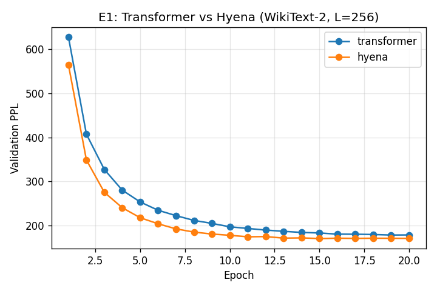
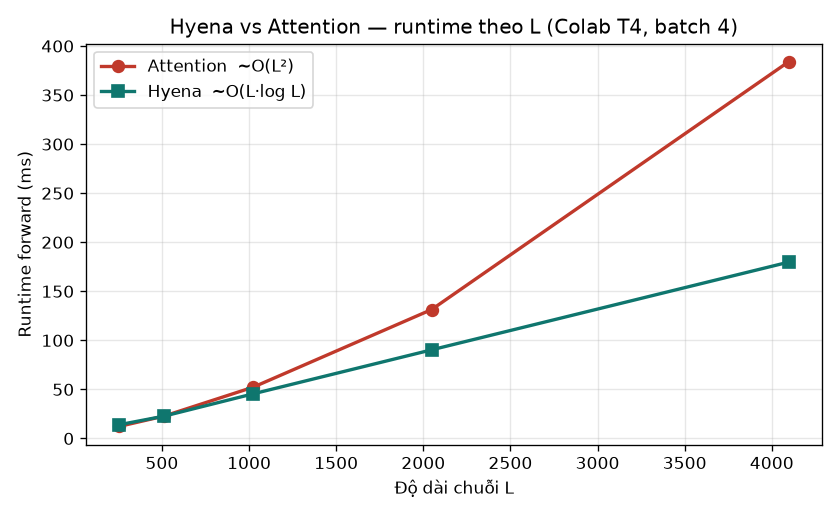

<!-- _class: lead -->
<!-- _paginate: false -->

<div class="titlebox">

# Hyena Hierarchy
### Towards Larger Convolutional Language Models

</div>

<span class="small">Bài báo: Poli, Massaroli, Nguyen, Dao, Baccus, Bengio, Ermon, Ré · Stanford & Mila · ICML 2023 (PMLR 202)</span>

<br>

**Nhóm 08 · CS2308**
Trần Tú Quang · Tô Huỳnh Minh Tiến · Nguyễn Cao Trung Kiên

<span class="small">GVHD: TS. Nguyễn Văn Kiệt · University of Information Technology, VNU-HCM (UIT) · 2026</span>

<!--
Notes:
Mở đầu cả buổi (TV1 — Kiên). Dẫn người nghe từ Transformer/Attention tới đúng "vấn đề" mà Hyena giải quyết; bàn giao Tiến (TV2) cho cơ chế Hyena; Quang (TV3) cho phần tái hiện thực nghiệm.
-->

---

## Nội dung trình bày

1. **Bối cảnh & động lực** — vì sao cần thay thế attention
2. **Nhắc lại nền tảng** — Language Modeling, Perplexity, Transformer
3. **Self-Attention & nút thắt** — cơ chế Q, K, V và chi phí $O(L^2)$
4. **Khoảng cách năng lực & Related Work** — SSM → H3/GSS → Hyena → Mamba
5. **Cơ chế Hyena** — long convolution + data-controlled gating + recurrence
6. **Hiện thực hiệu quả & kết quả paper** — matrix view, FFTConv, complexity
7. **Thực nghiệm** — Transformer-small và Hyena-small trên WikiText-2

<!--
Notes:
Nói nhanh agenda (~30s): 4 mạch của Kiên, 2 mạch của Tiến (method + results), phần thực nghiệm tái hiện của Quang.
-->

---

<!-- _class: divider -->
<!-- footer: '<span>Nhóm 08 · CS2308</span><span>1 · Bối cảnh & động lực</span><span>2026</span>' -->

<div class="dnum">1</div>

<div class="dbar"></div>

# Bối cảnh & Động lực

<div class="dsub">Vì sao attention O(L²) là nút thắt · long-context · capability gap</div>

<div class="dmeta">Phần 1</div>


---

## Câu hỏi nghiên cứu

### "Is attention all we need?"

- Self-attention là **trái tim** của Transformer và tạo nên hầu hết thành công của nó.
- Nhưng attention có **chi phí bậc hai** $O(L^2)$ theo độ dài chuỗi $L$ → đặt **giới hạn cứng** lên lượng ngữ cảnh.
- Các toán tử dưới-bậc-hai trước đây (Linformer, Reformer, Performer, sparse…) đều phải **lai ghép** với attention dày đặc mới đạt chất lượng.

<div class="box">

**Câu hỏi trung tâm (paper · Section 1):**
*“Are there subquadratic operators that, inspired by its properties, are able to match its quality at scale?”*

</div>

→ Mục tiêu: toán tử **không-attention**, rẻ hơn, **không cần hybridization**, vẫn sánh ngang Transformer.

<!--
Notes:
"Hook" của cả bài. Đọc to câu hỏi nghiên cứu. Nhấn: paper không xấp xỉ attention mà hỏi liệu có operator KHÁC thay được không.
-->

---

## Vì sao long-context quan trọng?

- Nhiều bài toán thực tế cần **ngữ cảnh dài**: cả cuốn sách, mã nguồn dài, hội thoại dài, văn bản luật.
- Ngoài ngôn ngữ: **chuỗi sinh học (DNA / protein)**, âm thanh dài, ảnh gigapixel.
- Nhưng $L$ tăng → attention tăng chi phí theo $L^2$ → nhanh chóng **hết bộ nhớ (OOM)** và **chậm**.

<div class="box">

"Phá vỡ rào cản bậc hai" mở ra: dùng cả textbook làm ngữ cảnh, sinh nhạc dài, xử lý ảnh cực lớn *(paper · Section 1)*.

</div>

<!--
Notes:
Cho 2-3 ví dụ cụ thể để khán giả thấy long-context không phải nhu cầu lý thuyết. Đây là động lực để tìm operator rẻ hơn.
-->

---

<!-- _class: divider -->
<!-- footer: '<span>Nhóm 08 · CS2308</span><span>2 · Nhắc lại nền tảng</span><span>2026</span>' -->

<div class="dnum">2</div>

<div class="dbar"></div>

# Nhắc lại nền tảng

<div class="dsub">Language Modeling · Perplexity · kiến trúc Transformer</div>

<div class="dmeta">Phần 2</div>


---

## Nhắc lại: Language Modeling & Perplexity

**Autoregressive LM** — dự đoán token kế tiếp:

$$
P(w_1,\dots,w_n)=\prod_{t=1}^{n} P\!\left(w_t \mid w_{<t}\right)
$$

**Perplexity** — thước đo chất lượng LM (càng **thấp** càng tốt):

$$
\mathrm{PPL}=\exp\!\left(-\frac{1}{N}\sum_{t=1}^{N}\log P\!\left(w_t \mid w_{<t}\right)\right)=\exp(\text{loss})
$$

<span class="small">Trong PyTorch: PPL = exp(validation cross-entropy). Đây cũng là metric nhóm dùng ở phần thực nghiệm (Quang).</span>

<!--
Notes:
Giữ gọn. Khán giả chỉ cần nhớ: PPL thấp = đoán token tốt hơn. Cầu nối tới kết quả perplexity của paper và phần reproduction.
-->

---

## Nhắc lại kiến trúc Transformer

<div class="flow row">
<div class="step">Tokens</div>
<div class="ar">▶</div>
<div class="step">Token + Positional Embedding</div>
<div class="ar">▶</div>
<div class="step fill">N × Transformer Block</div>
<div class="ar">▶</div>
<div class="step">LayerNorm → LM Head → logits</div>
</div>

**Một Transformer Block** (Pre-LN + residual):

$$
\begin{aligned}
\mathbf{x} &\;\leftarrow\; \mathbf{x} + \mathrm{MHA}\!\big(\mathrm{LN}(\mathbf{x})\big)\\[2pt]
\mathbf{x} &\;\leftarrow\; \mathbf{x} + \mathrm{FFN}\!\big(\mathrm{LN}(\mathbf{x})\big)
\end{aligned}
$$

→ **Self-Attention** là phép *trộn thông tin* giữa các token — và cũng chính là **nút thắt** ta cần phân tích.

<div class="box">

**FFN** xử lý **từng vị trí độc lập** (chi phí tuyến tính theo $L$) · **MHA** là phần **duy nhất** cho các token "nhìn nhau" — và cũng là nơi phát sinh chi phí $O(L^2)$.

</div>

<!--
Notes:
Định vị attention trong block. FFN xử lý theo từng vị trí; attention mới là phần trộn token-token (tốn O(L^2)).
-->

---

<!-- _class: divider -->
<!-- footer: '<span>Nhóm 08 · CS2308</span><span>3 · Self-Attention & nút thắt</span><span>2026</span>' -->

<div class="dnum">3</div>

<div class="dbar"></div>

# Self-Attention & nút thắt

<div class="dsub">Cơ chế Q, K, V · ma trận attention · O(L²) · FlashAttention</div>

<div class="dmeta">Phần 3</div>


---

## Self-Attention hoạt động thế nào

$$
\mathrm{Attention}(Q,K,V)=\mathrm{SoftMax}\!\left(\frac{QK^{\top}}{\sqrt{d_k}}\right)V
$$

- **B1.** Chiếu tuyến tính: $Q=XW_Q,\quad K=XW_K,\quad V=XW_V$.
- **B2.** Điểm tương quan: $S=QK^{\top}/\sqrt{d_k}$ → ma trận $L\times L$.
- **B3.** Causal mask + SoftMax theo hàng → trọng số $A$.
- **B4.** Tổng có trọng số: $\mathrm{Output}=A\,V$.

<span class="small">Multi-Head: chạy nhiều phép attention song song với các $W_Q,W_K,W_V$ khác nhau, rồi nối lại.</span>

<!--
Notes:
Ẩn dụ truy vấn–khóa–giá trị. Nhấn: bước B2 tạo ma trận L×L — gốc rễ của O(L^2). Dẫn sang slide ma trận attention.
-->

---

## Ma trận Attention & Causal Mask

<div class="grid2">
<div>

- Mỗi token tính tương quan với **mọi token** → ma trận $L\times L$.
- **Causal LM:** token tại $t$ chỉ "nhìn" $t'\le t$ → mask **tam giác dưới** ($-\infty$ ở tương lai, sau SoftMax $=0$).
- Số ô cần tính/lưu tỉ lệ với $L^2$.

</div>
<div class="center">

<div class="mono">
&nbsp;&nbsp;&nbsp;&nbsp;k0&nbsp;k1&nbsp;k2&nbsp;k3<br>
q0&nbsp;[&nbsp;●&nbsp;&nbsp;<span class="dim">·</span>&nbsp;&nbsp;<span class="dim">·</span>&nbsp;&nbsp;<span class="dim">·</span>&nbsp;]<br>
q1&nbsp;[&nbsp;●&nbsp;&nbsp;●&nbsp;&nbsp;<span class="dim">·</span>&nbsp;&nbsp;<span class="dim">·</span>&nbsp;]<br>
q2&nbsp;[&nbsp;●&nbsp;&nbsp;●&nbsp;&nbsp;●&nbsp;&nbsp;<span class="dim">·</span>&nbsp;]<br>
q3&nbsp;[&nbsp;●&nbsp;&nbsp;●&nbsp;&nbsp;●&nbsp;&nbsp;●&nbsp;]
</div>

<span class="small">● attend (quá khứ) · <span class="dim">·</span> bị mask</span>

</div>
</div>

→ Đây là lý do attention **không mở rộng** được khi $L$ rất lớn.

<!--
Notes:
Dùng hình tam giác để khán giả "thấy" vì sao chi phí là L×L. Nối sang slide O(L^2).
-->

---

## Nút thắt $O(L^2)$

<div class="grid2">
<div>

| $L$ | Số ô $L^2$ | $L$ tăng 2× |
|---|---|---|
| 256 | 65,536 | — |
| 512 | 262,144 | ~4× |
| 1,024 | 1,048,576 | ~4× |
| 8,192 | 67,108,864 | ~4× |
| 64,000 | ~4.1 × 10⁹ | → **OOM** |

</div>
<div>

- **Thời gian:** $QK^{\top}$, SoftMax, $AV$ đều $\sim O(L^2 d)$ mỗi lớp.
- **Bộ nhớ:** lưu ma trận $L\times L$ cho backprop $\Rightarrow O(L^2)$.

<div class="box">

$L$ tăng **2×** → chi phí tăng **~4×**. Đây là rào cản chính cần phá vỡ.

</div>

</div>
</div>

<!--
Notes:
Slide "đinh" của TV1. Để khán giả nhìn bảng và tự thấy độ tăng bậc hai. Câu chốt: gấp đôi độ dài thì gấp bốn chi phí.
-->

---

## FlashAttention có giải quyết triệt để?

- **FlashAttention** (Dao et al., 2022) tối ưu **truy cập bộ nhớ (IO-aware)**: không vật chất hóa toàn bộ ma trận $L\times L$, tính theo khối trên SRAM.
- → Giảm mạnh **bộ nhớ thực tế**, nhanh hơn 2–4× so với attention thường.

<div class="warn">

**Nhưng:** số phép tính vẫn là $O(L^2)$ — FlashAttention tối ưu *cách chạy*, không đổi *độ phức tạp*. Vẫn khó vươn tới ngữ cảnh cực dài.

</div>

→ Cần một toán tử có **độ phức tạp dưới bậc hai** thật sự, không chỉ tối ưu hằng số.

<!--
Notes:
Câu này hay bị thầy hỏi → nói rõ: FlashAttention là kỹ thuật cài đặt (IO-aware), compute vẫn O(L^2). Đây là lý do paper Hyena vẫn cần thiết.
-->

---

<!-- _class: divider -->
<!-- footer: '<span>Nhóm 08 · CS2308</span><span>4 · Khoảng cách năng lực & Related Work</span><span>2026</span>' -->

<div class="dnum">4</div>

<div class="dbar"></div>

# Khoảng cách năng lực & Related Work

<div class="dsub">Ba năng lực cốt lõi · SSM → H3/GSS → Hyena → Mamba</div>

<div class="dmeta">Phần 4</div>


---

## Khoảng cách năng lực (Capability Gap)

Vì sao các toán tử rẻ trước đây **thua** attention? Paper dùng **mechanistic interpretability** để rút ra **3 năng lực** cần giữ:

| Năng lực | SSM / Conv tĩnh | Attention |
|---|---|---|
| **Data control** — phụ thuộc dữ liệu | <span class="no">Không</span> (tĩnh) | <span class="yes">Có</span> — $A(u)$ |
| **Unrestricted context** — ngữ cảnh không giới hạn | <span class="no">Không</span> (bị locality) | <span class="yes">Có</span> |
| **Sublinear params** — tham số ⟂ độ dài chuỗi | <span class="yes">Có</span> | <span class="yes">Có</span> |

<div class="box">

Hyena được thiết kế để **giữ đồng thời cả ba** — thay vì *xấp xỉ* attention, ta *tái dựng* tính chất của nó bằng primitive rẻ hơn.

</div>

<!--
Notes:
3 tính chất này là bản lề bàn giao sang Tiến: long convolution + gating dựng lại đúng 3 tính chất này.
-->

---

<!-- _class: tight -->

## Related Work — Hyena nằm ở đâu?

<div class="chips">
<span class="chip alt">Attention 2017</span><span class="sep">→</span>
<span class="chip alt">SSM</span><span class="sep">→</span>
<span class="chip alt">S4 2021</span><span class="sep">→</span>
<span class="chip alt">H3 / GSS 2022</span><span class="sep">→</span>
<span class="chip hot">Hyena 2023</span><span class="sep">→</span>
<span class="chip alt">Mamba ’23</span>
</div>

| Kiến trúc | Phép trộn | Gating | Train | Ghi chú |
|---|---|---|---|---|
| Transformer | Attention | — | $O(L^2)$ | đầy đủ ngữ cảnh, nghẽn $L^2$ |
| S4 | SSM (conv) | Không | $O(L\log L)$ | học phụ thuộc dài, thiếu data-control |
| H3 / GSS | SSM (conv) | Có | $O(L\log L)$ | attention-free đầu tiên sánh Transformer 125M |
| **Hyena** | **Implicit long conv** | Có (recurrence bậc N) | $O(N\,L\log L)$ | **tổng quát hóa H3/GSS**, filter tự do |
| Mamba | Selective SSM | Có | $O(L)$ | ra **sau** Hyena, filter động theo input |

<span class="small">Hyena bậc 2 ⟺ H3 · Hyena bậc 1 ⟺ GSS. "Hierarchy" = họ toán tử có thứ bậc, mô hình cũ là tầng thấp.</span>

<!--
Notes:
Không đi sâu toán. Khán giả thấy "dòng chảy" tiến hóa và vị trí Hyena. Mamba để sau Hyena, nhắc nhẹ để không hiểu nhầm thứ tự thời gian.

★ CÂU CHỐT & BÀN GIAO sang Tiến:
"Ta đã thấy Attention rất mạnh nhưng vướng O(L²), và rút ra ba năng lực cần giữ: data control, ngữ cảnh không giới hạn, tham số độc lập độ dài. Câu hỏi cho phần tiếp theo: làm sao dựng lại đúng ba năng lực đó bằng một toán tử rẻ hơn? Mời Tiến trình bày cơ chế Hyena."
-->

---

<!-- _class: divider -->
<!-- footer: '<span>Nhóm 08 · CS2308</span><span>5 · Cơ chế Hyena</span><span>2026</span>' -->

<div class="dnum">5</div>

<div class="dbar"></div>

# Cơ chế Hyena

<div class="dsub">Long convolution · data-controlled gating · recurrence · hierarchy</div>

<div class="dmeta">Phần 5</div>


---

## Từ Attention Sang Hyena

<div class="box">

**Câu hỏi trọng tâm:** Hyena thay thế self-attention bằng toán tử nào, và vì sao toán tử đó rẻ hơn khi context dài?

</div>

| Attention làm tốt | Vấn đề khi `L` dài | Hyena thay bằng |
|---|---|---|
| Trộn thông tin toàn chuỗi | Ma trận `L × L` | **Long convolution** |
| Trọng số phụ thuộc nội dung | So sánh mọi cặp token | **Data-controlled gating** |
| Tính toán trên context dài | `O(L²)` time/memory | **FFTConv `O(L log L)`** |

<span class="small">Điểm quan trọng: Hyena không tối ưu attention cũ, mà đề xuất một operator attention-free mới.</span>

<!--
Notes:
Phân công nói: Kiên -> attention bottleneck; Tiến -> Hyena operator; Quang -> small-scale reproduction.
Nhấn mạnh Hyena không phải "attention approximation".
Slide chuyển ý từ phần TV1 sang phần method: vấn đề không chỉ là tốc độ, mà là tìm operator thay thế vẫn đủ expressive cho language modeling.
-->

---

## Ý Tưởng Chính Của Hyena

### Hyena = Long Convolution + Data-Controlled Gating

<div class="grid2">

<div>
<strong>Long convolution</strong>
<ul>
  <li>Filter dài gần bằng sequence.</li>
  <li>Mang tín hiệu từ token xa.</li>
  <li>Tính nhanh bằng FFTConv.</li>
</ul>

</div>

<div>
<strong>Gating</strong>
<ul>
  <li>Sinh từ projection của input.</li>
  <li>Nhân element-wise với output conv.</li>
  <li>Tạo tính content-aware.</li>
</ul>

</div>

</div>

<div class="pipeline">
Input u<br>
 -> projections: gates x1...xN, value v<br>
 -> z1 = v<br>
 -> repeat n=1..N: z(n+1) = x(n) * Conv(h(n), z(n))<br>
 -> output y
</div>

<span class="small">Câu nói ngắn: convolution truyền thông tin xa, gating quyết định giữ thông tin nào.</span>

<!--
Notes:
Slide bản đồ. Các slide sau sẽ bóc từng mảnh: long conv, gating, recurrence, implicit filter, FFTConv.
-->

---

## Long Convolution

### Từ local kernel sang full-context filter

<div class="grid2">

<div class="box">
<strong>CNN thường</strong><br>
Kernel ngắn, local<br>
Nhìn vài token lân cận
</div>

<div class="box">
<strong>Hyena</strong><br>
Filter dài bằng sequence<br>
Nhận tín hiệu từ rất xa phía trước
</div>

</div>

$$
(h * u)_t = \sum_{i=0}^{t} h_{t-i}u_i
$$

```text
CNN local:   token t chỉ nhận từ vùng gần     [x x x] ---- t
Long conv:   token t có thể nhận từ rất xa phía trước    [x x x x x x x x x] t
```

<span class="small"><strong>Ý nghĩa:</strong> mô hình hóa phụ thuộc xa mà không cần attention matrix <code>L × L</code>.</span>

<!--
Notes:
Giải thích công thức ở mức trực giác: output tại t là tổng có trọng số của các token trước đó.
Causal conv chỉ nhìn quá khứ, phù hợp language modeling.
-->

---

## Data-Controlled Gating

### Vì sao cần gating?

- Convolution thuần thường khá **tĩnh**: cùng filter áp dụng cho mọi input.
- Language modeling cần chọn lọc theo **ngữ cảnh input**.
- Hyena dùng gate `xⁿ` được chiếu từ input, rồi nhân với output convolution.

<div class="grid2">

<div class="pipeline">
conv output:<br>
[0.8, 0.4, 0.9, 0.2]<br><br>
gate x:<br>
[1.0, 0.1, 0.7, 0.0]
</div>

<div class="pipeline">
selected signal:<br>
[0.8, 0.04, 0.63, 0.0]<br><br>
gate cao -> giữ<br>
gate thấp -> giảm
</div>

</div>

> Long convolution đưa thông tin từ xa về; gating quyết định thông tin nào nên được giữ lại.

<!--
Notes:
Slide quan trọng để trả lời "Hyena data-controlled như thế nào?"
Gate không phải cổng logic 0/1 cứng; nó là tín hiệu liên tục, học được, phụ thuộc input.
-->

---

## Hyena Recurrence

### Công thức trung tâm

$$
z^{n+1}_t = x^n_t \cdot (h^n * z^n)_t
$$

<div class="grid2">

<div>
<table>
  <thead>
    <tr><th>Thành phần</th><th>Ý nghĩa</th></tr>
  </thead>
  <tbody>
    <tr><td><code>z¹ = v</code></td><td>value stream ban đầu</td></tr>
    <tr><td><code>hⁿ</code></td><td>long filter ở bước <code>n</code></td></tr>
    <tr><td><code>xⁿ_t</code></td><td>gate tại token <code>t</code></td></tr>
    <tr><td><code>N</code></td><td>số bậc/order</td></tr>
  </tbody>
</table>

</div>

<div class="pipeline">
Bước n:<br>
1. lấy z(n)<br>
2. Conv với filter h(n)<br>
3. nhân gate x(n)<br>
4. ra z(n+1)
</div>

</div>

<span class="small">Output cuối: `y = z^(N+1)`.</span>

<!--
Notes:
Slide trọng tâm nhất của Tiến. Giải thích từng biến thật chậm.
Nếu bị hỏi "Hyena khác CNN ở đâu?": CNN chủ yếu conv; Hyena xen kẽ conv dài và gate phụ thuộc input nhiều bước.
-->

---

## Order-N Hierarchy

### Vì sao gọi là "Hierarchy"?

- Hyena có thể lặp nhiều bước **convolution + gating**.
- `N` càng lớn, operator càng biểu diễn phong phú hơn.
- H3 có thể xem như Hyena bậc 2; GSS như Hyena bậc 1 với filter SSM.
- Trong repo nhóm: Hyena-small dùng **`order = 2`** để dễ reproduction.

<div class="pipeline">
Order 1:  z1 -> Conv h1 -> Gate x1 -> z2<br>
Order 2:  z1 -> Conv h1 -> Gate x1 -> z2 -> Conv h2 -> Gate x2 -> z3<br>
Order N:  repeat N lần -> output
</div>

<!--
Notes:
Không cần giải thích sâu H3/GSS, chỉ nói Hyena tổng quát hóa ý tưởng gating + convolution.
Không cần chứng minh hierarchy; chỉ cần nắm: mỗi order thêm một tầng tương tác có cấu trúc.
-->

---

<!-- _class: divider -->
<!-- footer: '<span>Nhóm 08 · CS2308</span><span>6 · Hiện thực hiệu quả & kết quả paper</span><span>2026</span>' -->

<div class="dnum">6</div>

<div class="dbar"></div>

# Hiện thực hiệu quả & Kết quả paper

<div class="dsub">Matrix view · implicit filter · FFTConv · complexity · kết quả paper</div>

<div class="dmeta">Phần 6</div>


---

## Matrix View

### Từ attention matrix sang operator có cấu trúc

| Thành phần Hyena | Dạng ma trận | Trực giác |
|---|---|---|
| Gating `xⁿ` | Diagonal matrix `Dₓ` | nhân từng vị trí/channel |
| Convolution `hⁿ * zⁿ` | Toeplitz matrix `Sₕ` | trượt cùng một filter qua chuỗi |

<div class="box">

Hyena xen kẽ `Dₓ` và `Sₕ`, thay vì tạo một attention matrix dense `L × L`.

</div>

```text
Attention:    y = A(x) · v        A là dense L x L
Hyena:        y ≈ D_x2 · S_h2 · D_x1 · S_h1 · v
```

<span class="small">Điểm chính: vẫn phụ thuộc input qua `Dₓ`, nhưng tận dụng cấu trúc để tính rẻ hơn.</span>

<!--
Notes:
Slide khó nhất. Chỉ nói trực giác, không chứng minh butterfly decomposition.
Nếu thầy hỏi sâu: D_x là diagonal nên nhân rẻ; S_h có cấu trúc convolution nên tính bằng FFT.
-->

---

<!-- _class: compact -->

## Implicit Filter

### Filter dài nhưng ít tham số

<span class="small"><strong>Sinh filter từ vị trí <code>t</code></strong></span>

$$
h_t = \mathrm{Window}(t) \cdot \mathrm{FFN}(\mathrm{PE}(t))
$$

<span class="small"><strong>Explicit vs Implicit filter</strong></span>

| Cách học filter | Ý tưởng | Vấn đề/lợi ích |
|---|---|---|
| Explicit | lưu trực tiếp `h[0...L-1]` | dài hơn thì thêm tham số |
| Implicit | học hàm sinh `h_t` từ vị trí `t` | tham số nằm trong FFN |

<span class="small"><strong>Pipeline sinh filter</strong></span>

<div class="pipeline">
position t -> Positional Encoding -> small FFN -> raw filter value<br>
raw value * Window(t) -> h_t
</div>

<span class="small"><strong>Window/decay:</strong> giúp filter ổn định hơn ở các khoảng cách xa.</span>

<!--
Notes:
Ẩn dụ: học một công thức sinh filter thay vì học từng điểm của filter.
Đừng sa vào chi tiết kiến trúc FFN; mục tiêu là hiểu tại sao filter dài không làm số tham số nổ theo L.
-->

---

## FFTConv

### Tính long convolution hiệu quả

<div class="box">

**Ý tưởng:** chuyển convolution sang miền tần số để phép convolution trở thành phép nhân element-wise.

</div>

<div class="pipeline">
1. FFT(filter) và FFT(signal)<br>
2. Nhân element-wise trong miền tần số<br>
3. iFFT để quay lại sequence output
</div>

<div class="grid2">

<div class="box">
<strong>Direct convolution</strong><br>
Chi phí tăng nhanh khi filter rất dài<br>
Ít phù hợp với long-context
</div>

<div class="box">
<strong>FFTConv</strong><br>
Chi phí khoảng <code>O(L log L)</code><br>
Có lợi khi <code>L</code> lớn
</div>

</div>

<!--
Notes:
Không cần đi sâu Fourier. Chỉ cần giải thích "đổi miền để convolution thành phép nhân".
Cầu nối giữa công thức paper và code trong repo:
H = torch.fft.rfft(h, n=fft_len, dim=-1)
V = torch.fft.rfft(v, n=fft_len, dim=-1)
Y = H * V
y = torch.fft.irfft(Y, n=fft_len, dim=-1)[..., :L]
-->

---

<!-- _class: tight compact -->

## Complexity Và Ý Nghĩa

### Điểm rơi của Hyena là context dài

| Method | Compute theo `L` | Ý nghĩa thực tế |
|---|---|---|
| Standard Attention | `O(L²)` | tạo ma trận `L × L` |
| FlashAttention | `O(L²)` | giảm bộ nhớ, tối ưu IO |
| Hyena | `O(N · L log L)` | không tạo attention matrix |

<span class="small">Trong Hyena, `N` là order/số bước recurrence, thường được chọn nhỏ.</span>

<div class="box formula-card">
<strong>Công thức độ phức tạp tính toán của Hyena</strong><br>
<code>O(N · D · L · (log L + D))</code><br>
<span class="small"><code>D</code> là model width; bảng trên nhấn mạnh chi phí theo <code>L</code>.</span>
</div>

<div class="box">

Khi `L` tăng rất lớn, `L log L` tăng chậm hơn `L²`, nên lợi thế của Hyena rõ nhất ở long-context.

</div>

<!--
Notes:
Nhấn mạnh không nói Hyena luôn nhanh hơn. Lợi thế rõ nhất ở context dài.
FlashAttention vẫn là O(L^2) compute, nhưng tối ưu memory access rất tốt. Vì vậy ở L nhỏ/trung bình có thể vẫn cạnh tranh.
Paper ghi complexity đầy đủ hơn là O(N · D · L · (log L + D)); trên slide rút gọn theo L để người nghe thấy điểm khác biệt chính với attention.
Minh họa số: L=1K: L^2≈1M, LlogL≈10K. L=8K: L^2≈67M, LlogL≈106K. L=64K: L^2≈4.1B, LlogL≈1M.
-->

---

## Kết Quả Paper Gốc

### Paper báo cáo 2 nhóm kết quả: quality và efficiency

<div class="grid2">

<div>
<strong>Quality</strong>
<table>
  <thead>
    <tr><th>Benchmark</th><th>Kết quả</th></tr>
  </thead>
  <tbody>
    <tr><td>WikiText-103</td><td>Hyena-3 ~ Transformer 125M</td></tr>
    <tr><td>The Pile 335M</td><td>Hyena-2 cạnh tranh ở cùng quy mô</td></tr>
    <tr><td>Associative recall</td><td>giữ chất lượng ở 30K–131K, nhiều baseline OOM</td></tr>
  </tbody>
</table>

</div>

<div>
<strong>Efficiency</strong>
<table>
  <thead>
    <tr><th>Length</th><th>Kết quả runtime</th></tr>
  </thead>
  <tbody>
    <tr><td>2K</td><td>gần crossover</td></tr>
    <tr><td>8K</td><td>~5x vs attention, ~2x vs FlashAttention</td></tr>
    <tr><td>64K</td><td>~100x vs FlashAttention</td></tr>
  </tbody>
</table>

</div>

</div>

<div class="box">

Kết quả chính của paper: **Hyena thu hẹp khoảng cách chất lượng với Transformer, đồng thời thể hiện lợi thế rõ ở các bài toán context rất dài**.

</div>

<!--
Notes:
Novelty không nằm ở việc tối ưu attention cũ, mà ở chỗ paper đề xuất một operator attention-free mới kết hợp long convolution, gating và implicit filter.
Kết thúc bằng câu chuyển sang TV3 (Quang): paper chạy scale lớn; nhóm sẽ reproduction nhỏ hơn trên WikiText-2 để kiểm chứng xu hướng.
-->

---

<!-- _class: divider -->
<!-- footer: '<span>Nhóm 08 · CS2308</span><span>7 · Thực nghiệm</span><span>2026</span>' -->

<div class="dnum">7</div>

<div class="dbar"></div>

# Thực nghiệm

<div class="dsub">WikiText-2 · Transformer-small vs Hyena-small · perplexity & tốc độ</div>

<div class="dmeta">Phần 7</div>

<!--
Notes — Quang (0:45)

• Cảm ơn Tiến. Đến đây mọi người đã thấy Hyena hoạt động thế nào và paper báo cáo được những gì ở quy mô lớn.

• Phần cuối là phần của nhóm em: chúng em tự cài lại Hyena, tự train, và tự đo, để xem những điều paper nói có thật sự xảy ra ở quy mô nhỏ hay không.

• Em sẽ đi qua năm ý: phạm vi của việc tái hiện, cấu hình thực nghiệm, kết quả về chất lượng, kết quả về tốc độ, và cuối cùng là những giới hạn mà nhóm xin nói thẳng.

→ Chuyển: "Trước hết là phạm vi."
-->

---

## Phạm vi & mục tiêu

Nhóm không tái hiện toàn bộ paper, vì The Pile 800GB và GPU lớn vượt quá tài nguyên môn học. Thay vào đó nhóm làm tái hiện ở quy mô nhỏ, mục tiêu là **kiểm chứng xu hướng** chứ không khớp số tuyệt đối.

<div class="box">

Hai câu hỏi nhóm muốn tự trả lời:
1. Ở quy mô nhỏ, **perplexity** của Hyena có ngang Transformer không?
2. Khi **chuỗi dài** ra, Hyena có **lợi thế tốc độ** như paper dự đoán không?

</div>

Code do nhóm tự cài bằng thuần PyTorch, có đối chiếu với bản chính chủ `HazyResearch/safari`.

<!--
Notes — Quang (1:45)

• Nhóm em không tái hiện toàn bộ paper. Paper gốc train trên The Pile, tức là khoảng tám trăm gi-ga-bai văn bản, và cần cụm GPU rất lớn, vượt xa tài nguyên của một đồ án môn học.

• Vì vậy nhóm chọn làm ở quy mô nhỏ. Và em xin nói rõ ngay từ đầu: mục tiêu không phải khớp con số tuyệt đối của paper, mà là kiểm chứng xu hướng.

• Cụ thể, nhóm đặt ra hai câu hỏi để tự trả lời. Thứ nhất, ở quy mô nhỏ thì chất lượng của Hyena, đo bằng perplexity, có ngang Transformer không.

• Thứ hai, khi chuỗi dài ra thì Hyena có lợi thế tốc độ như paper dự đoán không.

• Một điểm em muốn nhấn mạnh: toàn bộ code là do nhóm tự cài bằng thuần PyTorch, và nhóm có đối chiếu từng phần với bản cài chính chủ của nhóm tác giả để chắc chắn mình cài đúng.

→ Chuyển: "Đây là cấu hình cụ thể."
-->

---

## Thiết lập thực nghiệm

Dữ liệu: WikiText-2, tokenizer GPT-2, cắt chuỗi theo độ dài 256.

| Cấu hình | Transformer-small | Hyena-small |
|---|---|---|
| Layers | 4 | 4 |
| `d_model` / `d_ff` | 256 / 1024 | 256 / 1024 |
| Trộn thông tin | 4 heads attention | order N=2, FFTConv |
| Params | 16.1M | 16.3M |

Hyena dùng `torch.fft.rfft` thuần PyTorch, không có custom CUDA kernel.
Huấn luyện bằng AdamW kèm warmup rồi cosine, đánh giá bằng val loss quy ra perplexity, chạy trên Colab T4.

<!--
Notes — Quang (2:00)

• Dữ liệu là WikiText-2, một tập văn bản Wikipedia chuẩn dùng để đánh giá mô hình ngôn ngữ. Nhóm dùng tokenizer của GPT-2 và cắt văn bản thành các đoạn dài 256 token.

• Để so sánh cho công bằng, nhóm dựng hai model cùng cỡ: cả hai đều bốn lớp, cùng số chiều ẩn là 256, cùng kích thước feed-forward là 1024.

• Chỉ khác nhau đúng một chỗ, là lớp trộn thông tin: Transformer dùng bốn đầu attention, còn Hyena dùng toán tử bậc hai với tích chập tính qua FFT.

• Số tham số gần như bằng nhau, mười sáu phẩy một triệu so với mười sáu phẩy ba triệu (16.1M vs 16.3M). Nên nếu một bên tốt hơn thì chắc chắn không phải vì nó to hơn.

• Hyena ở đây là bản thuần PyTorch, dùng hàm FFT có sẵn của thư viện, không có CUDA kernel viết riêng như paper.

• Cả hai model được train bằng AdamW, có warm-up rồi giảm dần theo cosine, đánh giá bằng val loss quy ra perplexity, và chạy trên GPU T4 miễn phí của Colab.

→ Chuyển: "Trước khi xem kết quả, em xin nói qua nhóm đã cài đặt như thế nào."
-->

---

<!-- _class: tight -->

## Nhóm cài đặt như thế nào

<div class="grid2">
<div>

**Công thức paper** (Tiến vừa trình bày):

$$
z^{n+1}_t = x^n_t \cdot (h^n * z^n)_t
$$

**Vòng lặp trong code của nhóm:**

```python
for n in range(self.order):
    h_n  = h_all[n]
    x_n  = gate_tensors[n]
    conv = causal_fft_conv(h_n, z)
    z    = x_n * conv
```

</div>
<div>

**Đối chiếu với bản chính chủ** `HazyResearch/safari`:

| Thành phần lõi | Bản nhóm |
|---|---|
| FFTConv đệm `2L` → cắt `L` đầu | <span class="yes">khớp</span> |
| Short conv depthwise | <span class="yes">khớp</span> |
| Số projection `= N+1` | <span class="yes">khớp</span> |
| Gating đệ quy bậc `N` | <span class="yes">khớp</span> |
| Activation của filter | <span class="no">SiLU (gốc: sin)</span> |
| Modulation · skip-conn | <span class="no">rút gọn · bỏ</span> |

</div>
</div>

<span class="small">Nhóm không chạy lại code tác giả (cần CUDA kernel riêng, khó dựng trên Colab) mà cài lại phần lõi rồi đối chiếu.</span>

<!--
Notes — Quang (1:15)

• Slide này để trả lời trước một câu mà nhóm đoán thầy sẽ hỏi: code này ở đâu ra, và có tin được không.

• Bên trái, phía trên là công thức recurrence mà Tiến vừa trình bày, phía dưới là vòng lặp thật trong code của nhóm. Mỗi bước lấy filter thứ n, lấy gate thứ n, cho qua tích chập FFT, rồi nhân với gate. Khớp một-một với công thức, không thêm không bớt bước nào.

• Bên phải là bảng đối chiếu với bản chính chủ. Bốn thành phần lõi thì khớp: tích chập FFT có đệm gấp đôi rồi cắt lại phần đầu để giữ tính nhân quả, tích chập ngắn theo từng kênh, số phép chiếu bằng bậc N cộng một, và gating đệ quy bậc N.

• Còn hai chỗ nhóm đơn giản hóa thì em xin nói thẳng luôn: filter dùng SiLU thay cho dạng sin, phần modulation rút gọn và bỏ skip-connection.

• Vì vậy nhóm không dám nói đây là bản sao y bản gốc. Nhóm chỉ nói: phần lõi đã cài đúng, đủ để những con số sau đây có ý nghĩa.

→ Chuyển: "Trước hết là kết quả về chất lượng."
-->

---

## Kết quả E1: Perplexity (L=256)

<div class="grid2">
<div>

| Model | Val loss | Val PPL |
|---|---|---|
| Transformer-small | 5.18 | 178.0 |
| Hyena-small | **5.14** | **170.1** |

Hai model cùng cỡ tham số cho perplexity gần như **ngang nhau** — Hyena nhỉnh hơn **~4%**, và thấp hơn ở **mọi epoch**.

<span class="small">20 epoch trên WikiText-2. Đường PPL đã đi ngang (gần hội tụ).</span>

</div>
<div class="center">



<span class="small">Val perplexity theo epoch</span>

</div>
</div>

<div class="box">

Đủ để kết luận: kiến trúc **không dùng attention** vẫn học ngôn ngữ ngang Transformer ở cùng cỡ tham số — Hyena là một baseline hợp lệ ở quy mô này.

</div>

<!--
Notes — Quang (3:15)

• Trước hết, perplexity là độ bối rối của model khi đoán token tiếp theo. Hiểu nôm na là trung bình model đang phân vân giữa bao nhiêu lựa chọn. Càng thấp thì càng tốt.

• Sau hai mươi epoch, Transformer đạt perplexity khoảng 178, còn Hyena khoảng 170. Hyena thấp hơn khoảng bốn phần trăm (~4%).

• Mời thầy và các bạn nhìn sang biểu đồ bên phải. Đây là perplexity theo từng epoch, đường của Hyena nằm dưới đường của Transformer ở mọi epoch, chứ không phải chỉ hơn ở điểm cuối.

• Em xin nói thêm hai điều cho trung thực. Thứ nhất, nhìn vào biểu đồ thì thấy về cuối cả hai đường đều đã đi ngang, tức là gần hội tụ, nên đây là con số ổn định chứ không phải chụp đúng lúc đang dao động.

• Thứ hai, khoảng cách bốn phần trăm là nhỏ, nên nhóm không kết luận Hyena tốt hơn Transformer nói chung; cũng có thể do Transformer chưa được tinh chỉnh kỹ.

• Điều nhóm muốn rút ra là: một kiến trúc hoàn toàn không dùng attention vẫn học được ngôn ngữ ở mức tương đương Transformer. Như vậy đủ để xem Hyena là một baseline hợp lệ, và đây đúng là điều paper khẳng định.

→ Chuyển: "Còn về tốc độ, đây mới là điểm mạnh thật sự của Hyena."
-->

---

<!-- _class: tight -->

## Kết quả: tốc độ & bộ nhớ theo độ dài chuỗi

<div class="grid2">
<div>

<span class="small">Forward với input giả, ~16M tham số, batch 4, Colab T4:</span>

| L | TF (ms) | Hyena (ms) | Tỉ lệ |
|---|---|---|---|
| 256 | 12.3 | 14.1 | 0.87× |
| 512 | 22.8 | 22.7 | 1.00× |
| 1024 | 52.3 | 45.5 | 1.15× |
| 2048 | 131.4 | 90.4 | 1.45× |
| 4096 | **383.9** | **179.7** | **2.14×** |

</div>
<div class="center">



<span class="small">Runtime forward theo độ dài chuỗi</span>

</div>
</div>

- **Tốc độ:** Hyena chậm hơn ở `L=256` (overhead FFT), hòa quanh `L=512`, rồi vượt dần. Mỗi lần gấp đôi `L`: attention tăng ~×2.5–3 (bình phương), Hyena chỉ ×2 (tuyến tính) — throughput Hyena giữ ~**90K token/s** ở mọi `L`, TF tụt từ 83K xuống 43K.
- **Bộ nhớ:** gần bằng nhau (3297 vs 3234 MB ở `L=4096`) — ở `d_model` nhỏ này khác biệt $O(L^2)$ chưa lộ rõ; lợi thế thấy được nằm ở **thời gian**.

<!--
Notes — Quang (3:45)

• Ở thí nghiệm này nhóm đo thời gian một lượt forward khi tăng dần độ dài chuỗi, vẫn là model mười sáu triệu tham số, batch bằng bốn, chạy trên Colab T4. Xin lưu ý đây là phép đo tốc độ, tách riêng khỏi thí nghiệm perplexity vừa rồi.

• Mời thầy và các bạn nhìn bảng từ trên xuống. Ở L bằng 256, Hyena thực ra còn chậm hơn một chút, mười bốn phẩy một mili-giây so với mười hai phẩy ba, vì FFT có chi phí cố định.

• Đến L bằng 512 thì hai bên hòa nhau. Từ L bằng 1024, Hyena bắt đầu vượt lên, nhanh hơn khoảng một phẩy mười lăm lần (1.15×).

• Lên 2048 là một phẩy bốn mươi lăm lần (1.45×). Và ở 4096, Transformer mất ba trăm tám mươi tư mili-giây, còn Hyena chỉ một trăm tám mươi, tức là nhanh hơn hai phẩy mười bốn lần (2.14×).

• Cách nhìn rõ nhất là nhìn vào nhịp tăng. Cứ gấp đôi L một lần, Transformer tăng khoảng hai phẩy năm đến ba lần, vì chi phí đi theo bình phương. Còn Hyena thì tăng đúng gấp đôi, tức là gần tuyến tính.

• Nói cách khác, thông lượng của Hyena giữ gần như không đổi, khoảng chín mươi nghìn token mỗi giây ở mọi độ dài, trong khi Transformer tụt từ tám mươi ba nghìn xuống còn bốn mươi ba nghìn.

• Bây giờ mời thầy và các bạn nhìn sang biểu đồ bên phải, nó cho thấy điều đó rõ hơn cả bảng số. Đường của Transformer vọt lên theo dạng cong, còn đường của Hyena đi lên thoai thoải, gần như là một đường thẳng.

• Hai đường cắt nhau quanh L bằng 512, và càng về sau thì càng cách xa nhau. Đây đúng là hình dạng mà lý thuyết dự đoán: một bên là L bình phương (L²), một bên là L nhân log L (L log L).

• Về bộ nhớ thì hai bên gần bằng nhau ở mọi độ dài đo được, ba nghìn hai trăm chín mươi bảy so với ba nghìn hai trăm ba mươi tư mê-ga-bai ở L bằng 4096.

• Ở số chiều ẩn nhỏ như thế này, phần bộ nhớ ô lớn của L bình phương bên phía attention chưa đủ lớn để lộ ra, nó vẫn bị lấn át bởi bộ nhớ của các lớp còn lại.

• Vì vậy nhóm xin nói thẳng: lợi thế mà nhóm quan sát được nằm ở thời gian, chứ chưa nằm ở bộ nhớ. Và xin nhắc lại, đây là số của nhóm em trên WikiText-2, không phải số trong paper.

→ Chuyển: "Trước khi kết luận, em xin nói thẳng những giới hạn."
-->

---

## Thảo luận và giới hạn

- Ở chuỗi ngắn Hyena chậm hơn, vì chi phí FFT và đệm 2L lớn hơn phần tiết kiệm được. Hyena hòa ở khoảng `L = 512`, vượt lên từ `L = 1024` và nhanh **2.14×** ở `L = 4096`, đúng như lưu ý trong paper.
- Bản cài của nhóm có **đơn giản hóa** so với safari (SiLU thay activation dạng sin, modulation rút gọn, bỏ skip-connection) — vì vậy hội tụ có thể chậm hơn bản gốc.
- Vì dùng thuần PyTorch và không có CUDA kernel, nhóm chưa đạt mức speedup tuyệt đối như paper.
- Phần đo tốc độ dùng input giả để đo thời gian forward, không phải đánh giá perplexity trên tập validation.
- Cần phân biệt rõ: số trên WikiText-103, The Pile và speedup từ 8K đến 64K là của **paper gốc**, còn số WikiText-2 ở đây là của **nhóm**.

<!--
Notes — Quang (2:00)

• Nhóm em muốn rõ ràng về những điểm yếu, vì đây là một bài tái hiện chứ không phải một bài quảng cáo.

• Thứ nhất, như vừa thấy, ở chuỗi ngắn thì Hyena chậm hơn thật, vì chi phí của FFT và việc phải đệm chuỗi lên gấp đôi còn lớn hơn phần tiết kiệm được. Lợi thế chỉ rõ từ khoảng L bằng 1024 trở lên, và điều này đúng với lưu ý trong paper.

• Thứ hai, như em đã trình bày ở slide đối chiếu, bản cài của nhóm có vài chỗ đơn giản hóa. Điểm đáng kể nhất là dạng sin bắt tần số cao tốt hơn SiLU, nên bản của nhóm có thể hội tụ chậm hơn bản gốc.

• Thứ ba, vì là thuần PyTorch, không có kernel tối ưu, nên nhóm chưa đạt được mức tăng tốc tuyệt đối như paper công bố.

• Thứ tư, phần đo tốc độ dùng input giả để đo riêng thời gian forward, chứ không đánh giá chất lượng. Hai thí nghiệm này phải tách bạch, gộp chung lại là sai về mặt khoa học.

• Và cuối cùng là một điểm về tính trung thực: các con số ấn tượng trên WikiText-103, trên The Pile, hay mức tăng tốc ở sáu mươi tư nghìn token, đều là của paper gốc. Còn những gì nhóm em trình bày chỉ là kết quả ở quy mô nhỏ trên WikiText-2.

→ Chuyển: "Tóm lại."
-->

---

## Kết luận phần tái hiện

- Nhóm tự cài Hyena bằng thuần PyTorch, phần lõi khớp với bản chính chủ ở FFTConv đệm 2L, short conv depthwise và gating đệ quy bậc N.
- Quan sát đúng xu hướng chính của bài: tốc độ Hyena tăng gần tuyến tính, attention tăng theo bình phương, hai đường giao nhau quanh `L = 512` và Hyena vượt lên rõ từ `L = 1024`.
- Bài học rút ra: hiểu được vì sao attention nghẽn ở chuỗi dài, và thấy được giới hạn thực tế của tái hiện khi thiếu kernel tối ưu và tài nguyên.

> Quy mô nhỏ nhưng đủ để thấy tận mắt cơ chế dưới bậc hai mà bài báo đề xuất.

<!--
Notes — Quang (0:45)

• Em xin chốt lại bằng ba ý.

• Một, nhóm đã tự cài được Hyena bằng thuần PyTorch, và phần lõi khớp với bản chính chủ ở ba chỗ quan trọng nhất: tích chập qua FFT có đệm gấp đôi độ dài, tích chập ngắn theo từng kênh, và gating đệ quy nhiều bậc.

• Hai, nhóm quan sát đúng xu hướng chính của bài báo: chất lượng ngang Transformer, còn về tốc độ thì Hyena tăng gần tuyến tính trong khi attention tăng theo bình phương. Hai đường giao nhau quanh L bằng 512, và Hyena vượt lên rõ từ L bằng 1024.

• Ba, bài học lớn nhất với nhóm là hiểu được vì sao attention nghẽn ở chuỗi dài, và thấy được giới hạn thực tế của việc tái hiện khi mình thiếu kernel tối ưu và thiếu tài nguyên.

• Câu chốt: quy mô tuy nhỏ, nhưng đủ để nhóm em thấy tận mắt cơ chế dưới bậc hai mà bài báo đề xuất.

→ Chuyển: "Đó là toàn bộ phần tái hiện."
-->

---

<!-- _class: lead -->

# Cảm ơn! · Q&A

**Nhóm 08 · CS2308**
Trần Tú Quang · Tô Huỳnh Minh Tiến · Nguyễn Cao Trung Kiên

<span class="small">Tài liệu: Poli et al., *Hyena Hierarchy*, ICML 2023 · docs/poli23a.pdf
Tài liệu nhóm: README.md · notebooks/colab_E1_run.ipynb</span>

<!--
Notes — Quang (0:30)

• Đó là toàn bộ phần trình bày của nhóm 08. Chúng em xin cảm ơn thầy và các bạn đã lắng nghe.

• Nhóm sẵn sàng nhận câu hỏi về dữ liệu, về cách cài đặt, hoặc về kết quả.

[Đáp nhanh khi bị hỏi]

• Perplexity là gì? Là độ bối rối của model khi đoán token tiếp theo, càng thấp càng tốt.

• Sao perplexity vẫn cao? Vì model chỉ mười sáu triệu tham số và tập WikiText-2 nhỏ; đây là con số để so sánh tương đối giữa hai model, không phải con số tuyệt đối tốt.

• So sánh có công bằng không? Có, hai model cùng cỡ tham số, cùng dữ liệu, cùng cách train, cùng phần cứng.

• Sao Hyena chậm hơn ở chuỗi ngắn? Vì FFT phải đệm chuỗi lên gấp đôi rồi biến đổi qua lại, chi phí cố định đó lớn hơn phần tiết kiệm được khi L còn nhỏ.

• FFT giúp gì? Cho phép tính tích chập dài với chi phí L nhân log L thay vì L bình phương.

• Hyena khác Mamba hay H3 chỗ nào? Cùng họ thay thế attention, nhưng Hyena dùng tích chập dài tham số hóa ngầm cộng với gating, chứ không dùng state space tường minh.

• Vì sao không chạy lại code của tác giả? Vì bản đó cần CUDA kernel viết riêng và phiên bản thư viện đời cũ, rất khó dựng lại trên Colab; bản thuần PyTorch là lựa chọn hợp lý cho đồ án.
-->
